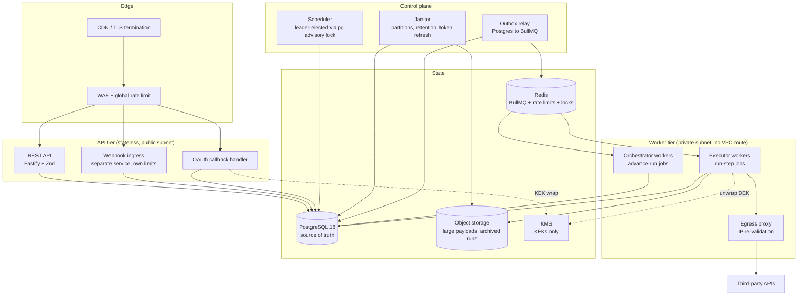

# Autobuild — Engineering Plan for a Multi-Tenant Workflow Automation Platform ("mini-Zapier")

**Status:** Plan only. No code written.
**Author:** Drafted by Claude (Cowork) for Wey / MWC Group — 2026-08-25.
**Review gate:** This document is a proposal. Nothing here has been implemented. Read §0 (Pushback) and §13 (Riskiest unknowns) first — they are the parts most likely to change your mind.

---

## Table of contents

0. [Pushback — read this first](#0-pushback--read-this-first)
1. [Feature parity scope](#1-feature-parity-scope)
2. [Architecture](#2-architecture)
3. [Execution engine semantics](#3-execution-engine-semantics)
4. [Data model](#4-data-model)
5. [Frontend](#5-frontend)
6. [Integrations and third-party auth](#6-integrations-and-third-party-auth)
7. [Security](#7-security)
8. [Compliance](#8-compliance)
9. [Observability and operations](#9-observability-and-operations)
10. [Testing strategy](#10-testing-strategy)
11. [Delivery roadmap](#11-delivery-roadmap) — *AI-assisted estimates; deployment timeline in §11.3*
12. [Decision log](#12-decision-log)
13. [Riskiest unknowns](#13-riskiest-unknowns)
14. [Assumptions and unverified claims](#14-assumptions-and-unverified-claims)

---

## 0. Pushback — read this first

You asked to hear objections now rather than later. Seven, in descending order of how much they would cost you to discover in month four.

### 0.1 BullMQ as the source of truth for run state is the wrong shape. Use it, but demote it.

BullMQ is a good job queue. It is not a workflow state store, and the failure mode when you treat it as one is data loss that looks like a bug in your code.

- BullMQ's own legacy notes say the queue "aims for an 'at least once' working strategy" and that a stalled job "is automatically restarted; it will be double processed" ([docs.bullmq.io/bull/important-notes](https://docs.bullmq.io/bull/important-notes)), even though the marketing page says "exactly once … but it will deliver at least once in the worst case scenario" ([docs.bullmq.io](https://docs.bullmq.io/)).
- Durability is Redis's problem, not BullMQ's. The production guide tells you to enable AOF and, verbatim, that setting `maxmemory-policy` to `noeviction` "is the **only** setting that guarantees the correct behavior of the queues" ([docs.bullmq.io/guide/going-to-production](https://docs.bullmq.io/guide/going-to-production)). With AOF `everysec` you can still lose ~1s of writes. A lost job in a job queue is a retry; a lost job when the job *is* your run state is a workflow that silently never finishes.
- Writing run state to Postgres and then enqueuing to Redis is a **dual write**. Crash between the two and the run exists but never advances; enqueue first and crash and you process a run that doesn't exist. This is the classic problem the transactional outbox pattern exists to solve ([microservices.io/patterns/data/transactional-outbox.html](https://microservices.io/patterns/data/transactional-outbox.html)).

**Recommendation:** Postgres owns every byte of run state. BullMQ carries only *pointers* — "advance run R" — and a lost or duplicated pointer is harmless because the run row is authoritative and the transition is idempotent. Enqueue through an outbox table written in the same transaction as the state change. This keeps BullMQ (you get delayed jobs, rate limiting, a mature dashboard, and Redis-speed dispatch) while removing the entire class of "the queue and the database disagree" bugs.

If you would rather have one datastore: **pg-boss** or **graphile-worker** make the outbox free, because enqueue *is* a row insert in your transaction. graphile-worker even lets you enqueue from a SQL trigger ([worker.graphile.org/docs](https://worker.graphile.org/docs/)). The cost is throughput and vacuum pressure. At portfolio-project scale that cost is zero and the simplification is large. See [§12 D-02](#d-02-queue-technology) for the full trade.

### 0.2 Do not execute user-supplied JavaScript. Not in `vm`, not in `vm2`.

Node's own documentation states, in the second sentence of the module page: "The `node:vm` module is not a security mechanism. **Do not use it to run untrusted code.**" ([nodejs.org/api/vm.html](https://nodejs.org/api/vm.html)). `vm2` has **54 advisories** in the GitHub Advisory Database, overwhelmingly critical sandbox escapes, including a large 2026 wave ([github.com/advisories?query=vm2](https://github.com/advisories?query=vm2)); the canonical one is CVE-2023-37466, CVSS 9.8 ([GHSA-cchq-frgv-rjh5](https://github.com/patriksimek/vm2/security/advisories/GHSA-cchq-frgv-rjh5)).

n8n gets away with a Code node because self-hosted n8n is effectively single-tenant — and even so it has shipped sandbox-escape CVEs: CVE-2025-68668 (Pyodide, arbitrary command execution — [GHSA-62r4-hw23-cc8v](https://github.com/n8n-io/n8n/security/advisories/GHSA-62r4-hw23-cc8v)) and CVE-2026-1470 / CVE-2026-0863 ([JFrog writeup](https://research.jfrog.com/post/achieving-remote-code-execution-on-n8n-via-sandbox-escape/)). Windmill uses nsjail — and ships it **disabled by default** (`DISABLE_NSJAIL=false` required), which produced CVE-2026-47107 ([windmill.dev/docs/advanced/security_isolation](https://www.windmill.dev/docs/advanced/security_isolation)).

**Recommendation:** for expressions and data mapping, use a non-Turing-complete evaluator — **JSONata** for shape transformation, **Liquid** for string interpolation. Neither has a host object graph to escape into. Defer a real Code step to a stretch goal, and when you build it, build it on QuickJS-in-WASM or a separate process with no IAM role, no metadata access and no database credentials — not on `isolated-vm` in the API process. See [§7.8](#78-expression-and-code-sandboxing) and [§12 D-07](#d-07-expression-language).

### 0.3 SSRF is not a checklist item on this project. It is the product's central security property.

Every other system has SSRF as a bug. Yours has "call an arbitrary URL the user typed" as a *feature*. That inverts the defence: you cannot allowlist destinations, so you land in OWASP's Case 2, where the cheat sheet is explicit that "deny-lists are bypass-prone" and application-layer validation is the weaker control ([OWASP SSRF Prevention Cheat Sheet](https://cheatsheetseries.owasp.org/cheatsheets/Server_Side_Request_Forgery_Prevention_Cheat_Sheet.html)).

Two things follow, and both are architectural, not incremental:

1. **All outbound traffic leaves through a dedicated egress path** — a separate worker pool in its own subnet with no route to your VPC internals, no route to `169.254.169.254`, IMDSv2 required with hop limit 1, and no IAM role worth stealing. This makes a validation bug non-exploitable rather than merely unlikely.
2. **Resolve-then-pin, every hop.** Undici/native `fetch` has no built-in SSRF protection; nodejs/undici issue #2019 has been open since March 2023 ([github.com/nodejs/undici/issues/2019](https://github.com/nodejs/undici/issues/2019)). You must supply a custom `lookup`/connect hook that validates the *resolved binary address* and then connects to that exact IP, passing the hostname only as SNI and `Host:`. Otherwise DNS rebinding walks straight through your check. This is not theoretical — Budibase, a comparable low-code platform, has live DNS-rebinding SSRF advisories ([GHSA-v42f-v8xc-j435](https://advisories.gitlab.com/npm/@budibase/server/GHSA-v42f-v8xc-j435/)).

Budget a full week for this even with AI assistance — the bypass *corpus* generates fast, but reading the validator adversarially does not — and treat it as a milestone, not a task. Full detail in [§7.6](#76-ssrf-defence-in-depth).

### 0.4 Polling triggers are three times the work you think, and they are where your platform will actually break.

Webhook triggers are easy. Cron is easy. **Polling** requires, per connector: cursor/watermark persistence, dedup of already-seen records, a first-run "don't replay the last 10,000 records" guard, backoff when the provider 429s, detection and recovery when the cursor goes stale, and a per-tenant scheduling fan-out that doesn't stampede at :00.

Gmail makes this concrete: `history.list` records "are typically available for at least one week and often longer" — not a guarantee — and a stale `startHistoryId` returns **HTTP 404**, forcing a full resync ([developers.google.com/workspace/gmail/api/guides/sync](https://developers.google.com/workspace/gmail/api/guides/sync)). Gmail push via Pub/Sub `watch()` expires after **7 days** and Google recommends renewing daily; it is rate-limited to **one event per second per user with excess dropped**, and is best-effort, so Google itself tells you to keep a polling fallback ([developers.google.com/workspace/gmail/api/guides/push](https://developers.google.com/workspace/gmail/api/guides/push)). Google Sheets has **no push at all** — you watch it through the Drive API, whose channels max out at 1 day for `files` / 1 week for `changes`, and "There's no automatic way to renew a notification channel" ([developers.google.com/workspace/drive/api/guides/push](https://developers.google.com/workspace/drive/api/guides/push)).

**Recommendation:** ship webhook + cron in MVP. Ship polling in v1 with **exactly one** polling connector so the machinery is proved, and treat "add a polling connector" as a bounded, templated exercise thereafter. Do not put four polling connectors in the same milestone.

### 0.5 Gmail restricted scopes will cost you six weeks and an annual audit. Don't start there.

`gmail.send` is a **sensitive** scope (~10 business days verification). `gmail.readonly` / `gmail.modify` are **restricted** and trigger a CASA security assessment because you store the data on your servers — ~**6 weeks** review, plus mandatory reverification "at least every 12 months" ([support.google.com/cloud/answer/13463817](https://support.google.com/cloud/answer/13463817), [restricted-scope verification](https://developers.google.com/identity/protocols/oauth2/production-readiness/restricted-scope-verification)). Google charges nothing itself; assessor fees are privately negotiated, and a free Tier 2 self-scan path exists — the widely-quoted dollar ranges have no Google primary source, so don't plan around a number.

Worse for a demo: in **Testing** mode, "If your OAuth client requests an `offline` access type and receives a refresh token, that token will also expire" — **refresh tokens die after 7 days** ([support.google.com/cloud/answer/15549945](https://support.google.com/cloud/answer/15549945)). Your demo will break every week.

**Recommendation:** worked connector examples become **SMTP (send) → generic HTTP → Google Sheets → Gmail `gmail.send`**, in that order. Gmail *inbound* is a stretch goal behind either an Internal (Workspace-only) app or a funded CASA. This is a change from your brief and I think it is the right one.

### 0.6 "Mini-Zapier" as you've scoped it is roughly a 4-month AI-assisted build, not a weekend.

For calibration on what parity actually means: Zapier caps Zaps at **100 steps**, Paths at **10 branches / 3 nesting levels**, Looping at **500 iterations with no nesting**, Delay at **30 days max / 1 minute min**, and autoreplay at **5 attempts on a +5m/+30m/+1h/+3h/+6h ladder** ([Zap limits](https://help.zapier.com/hc/en-us/articles/8496181445261-Zap-limits), [Looping](https://help.zapier.com/hc/en-us/articles/42969233918477-Understanding-Looping-by-Zapier), [Paths](https://help.zapier.com/hc/en-us/articles/8496288555917-Add-branching-logic-to-Zaps-with-Paths), [Delay](https://help.zapier.com/hc/en-us/articles/8496288754829-Add-delays-to-Zaps), [replay](https://help.zapier.com/hc/en-us/articles/19220226086797-What-is-replay)). Each of those numbers represents a bounded design decision someone had to make and defend. There are dozens more. [§11](#11-delivery-roadmap) phases this honestly, on an **AI-assisted** basis — and note there that the compression is uneven: the parts that make this project hard are the parts AI helps with least.

### 0.7 Say nothing about SOC 2 beyond "architected against."

SOC 2 is an opinion issued by a licensed CPA firm about an *organization* over an *observation period*. A solo project structurally cannot have board oversight (CC1), HR onboarding/offboarding controls, segregation of duties, a periodically-reviewed policy suite, incident-response drills, or independent penetration testing. Claiming "SOC 2 ready" is a misrepresentation a competent reviewer will spot instantly, and it costs more credibility than the honest framing gains. [§8.2](#82-soc-2-type-ii-readiness) gives you exact wording.

---

## 1. Feature parity scope

### 1.1 What "mini-Zapier" concretely means

A flow is a **directed acyclic graph** of one trigger node and N action/logic nodes. A run is one execution of one immutable flow *version* against one trigger event. Everything below is scoped against that sentence.

### 1.2 MVP — "it actually runs something, durably"

Target: a user can build a 3-step flow in a canvas, publish it, fire it with a webhook, watch it run, and see per-step input/output.

| Area | In MVP |
|---|---|
| **Triggers** | Webhook (HMAC-signed inbound URL per flow version); Cron/schedule (UTC + IANA tz, minimum 1-minute granularity); Manual / test-run |
| **Actions** | Generic HTTP Request (the workhorse); SMTP send email; Log/no-op (for testing) |
| **Flow shape** | Linear multi-step chains, up to 25 steps |
| **Data mapping** | JSONata expressions in `{{ }}`, referencing `$.trigger` and `$.steps.<slug>.output`; live preview against the last recorded run |
| **Filters** | Filter node — boolean JSONata predicate; false halts the run with status `filtered` |
| **Test-run mode** | Run the published-or-draft graph against a captured or hand-pasted sample payload; writes a run row flagged `is_test = true`, excluded from quotas and from production retention tiers |
| **Versioning** | Autosaved draft + immutable numbered published versions; runtime always resolves `published_version_id`; runs FK to the exact version that executed |
| **Engine** | At-least-once with idempotency keys, per-step timeouts, exponential backoff with full jitter, DLQ, resume-from-step, cancellation |
| **Auth** | Email+password with Argon2id, server-side sessions, single org per user |
| **Observability** | Structured JSON logs, correlation IDs across API→queue→worker, `/healthz` + `/readyz` |

**Explicitly not in MVP:** branching, loops, delays, polling, OAuth connectors, RBAC beyond owner, retention tiers, S3 payload offload.

### 1.3 v1 — "a reasonable person would use this"

| Area | In v1 |
|---|---|
| **Triggers** | + Polling trigger (Google Sheets rows, as the single proving case) with cursor persistence, dedup, first-run guard, per-tenant jitter; + Form-submit trigger (hosted form → webhook) |
| **Actions** | + Google Sheets (append row / read range / update range); + Gmail send via `gmail.send`; + Delay node |
| **Logic** | + Branch node (n-way, first-matching-predicate wins, à la Windmill "branch one" / Zapier Paths); + Loop node (fan-out over an array, **hard cap 500 iterations**, no nesting — matching Zapier's constraint deliberately); + Merge node |
| **Delays** | Durable delay, 1 minute to 30 days, surviving worker restarts and deploys |
| **Connections** | OAuth 2.0 + PKCE connection store; envelope-encrypted credentials; refresh with rotation and reuse detection |
| **Multi-tenancy** | Orgs, memberships, RBAC (owner / admin / editor / viewer), Postgres RLS as backstop |
| **Retention** | Partitioned run history, plan-tiered retention, S3 offload for payloads > 2 KB |
| **Ops** | Metrics, alerting, graceful shutdown with in-flight draining, blue/green-safe migrations |

### 1.4 Stretch

Sub-flows with typed I/O · human-in-the-loop **approval steps** with resume URLs, N-of-M approvals and timeouts (Windmill/Trigger.dev have this; **Zapier and Make do not** — this is the single strongest differentiator for a portfolio project, per [windmill.dev/docs/flows/flow_approval](https://www.windmill.dev/docs/flows/flow_approval) and [trigger.dev/docs/wait-for-token](https://trigger.dev/docs/wait-for-token)) · per-step error branches with the error object mapped downstream (Zapier's model) · workspace key-value data store · connector SDK + public connector docs · scheduled-flow backfill · webhook replay from history · a Code step in a hard sandbox.

### 1.5 Explicitly out of scope — and why

| Left out | Why |
|---|---|
| Real-time collaborative editing | Yjs/CRDT is a project of its own. n8n itself enforces "Only one person can edit a workflow at a time" ([docs](https://docs.n8n.io/build/understand-workflows/save-and-publish-workflows)). Single-editor lock with inactivity release is the right answer. |
| Transactional rollback / compensating actions | Make.com's ACID-tagged modules with commit/rollback ([help.make.com/rollback-error-handler](https://help.make.com/rollback-error-handler)) are genuinely good and genuinely a large design surface. Note it in the plan, don't build it. |
| A connector marketplace | Needs a review pipeline, sandboxing of third-party code, and a versioning story. |
| Nested loops | Zapier forbids them outright. Copy the constraint; it prevents a combinatorial cost explosion you cannot bill for. |
| Streaming / long-lived connections (websocket, IMAP IDLE) | Different concurrency model from a request/response worker pool. |
| Self-hosted / on-prem distribution | Doubles the security surface (you inherit the customer's network). |
| Billing and metering | Design the counters (`runs`, `step_executions`) so metering is possible later; don't build invoicing. |
| Mobile app | — |

---

## 2. Architecture

### 2.1 Component diagram



**Why webhook ingress is a separate service from the API.** Different SLO (must accept in <50 ms and never 5xx), different scaling curve (spiky), different rate-limit policy, and a different blast radius. Zapier separates these too — instant triggers get 20,000 requests / 5 min / user while polling gets 200 / 10 min / Zap on Free ([Zap limits](https://help.zapier.com/hc/en-us/articles/8496181445261-Zap-limits)). If your API is down, webhooks should still land.

**Why the egress proxy is its own hop.** See [§0.3](#03-ssrf-is-not-a-checklist-item-on-this-project-it-is-the-products-central-security-property). The executor validates and pins; the proxy validates *again* at connect time from a network position with no route anywhere interesting. Two independent controls, one of which is topological.

### 2.2 Request → execution lifecycle

Trace a webhook-triggered 4-step flow end to end.

**Phase 1 — ingress (target p99 < 50 ms)**

1. `POST /hooks/{endpoint_token}` hits webhook ingress. `endpoint_token` is a 256-bit random opaque value, not a flow ID (no enumeration, no tenant leak).
2. Look up the endpoint (cached in Redis, 30 s TTL). Reject unknown → 404, uniform timing.
3. Enforce body size cap (1 MB default, per-plan) **before** reading the body.
4. Capture the **raw body** before any JSON middleware — signature verification over a re-serialized body is broken by definition ([Stripe](https://docs.stripe.com/webhooks/signature)).
5. If the endpoint has a signing secret configured, verify HMAC-SHA256 with `crypto.timingSafeEqual`, and enforce a **5-minute timestamp window** (Stripe's default tolerance; Slack's rule is the same — [Stripe](https://docs.stripe.com/webhooks), [Slack](https://docs.slack.dev/authentication/verifying-requests-from-slack/)).
6. Replay check: `INSERT` into `webhook_deliveries (endpoint_id, dedup_key)` with a unique constraint. Conflict → 200 with `{"duplicate": true}`. Dedup key is the provider's event ID where available, else SHA-256 of `(timestamp || raw_body)`.
7. **One transaction:** insert `runs` row (`status = 'queued'`), insert `step_executions` rows for every node in the version's topological order (`status = 'pending'`), insert the trigger payload, insert an `outbox` row `{type: 'advance_run', run_id}`.
8. `COMMIT`. Return **202** with `{run_id}`. Total DB round-trips: 1 read (cached), 1 write transaction.

Note what did *not* happen: no Redis write, no synchronous work, no third-party call. The response is durable the moment the transaction commits.

**Phase 2 — dispatch**

9. The outbox relay (`LISTEN`/`NOTIFY` for latency, plus a 250 ms poll as a floor) claims rows with `SELECT ... FOR UPDATE SKIP LOCKED LIMIT 100` ([PG SELECT docs](https://www.postgresql.org/docs/current/sql-select.html)) and pushes to the `advance-run` BullMQ queue with `jobId = run_id` and `deduplication: { id: run_id }` ([BullMQ deduplication](https://docs.bullmq.io/guide/jobs/deduplication)), then deletes the outbox rows. Duplicate pushes are harmless — the orchestrator is idempotent.

**Phase 3 — orchestration (one job per state transition)**

10. An orchestrator worker picks up `advance-run`. It loads the run and its step rows in one query, computes the next runnable step from the persisted topology, and:
    - all steps terminal → set run status, emit `run.completed`, done;
    - next step is a delay → set `status = 'sleeping'`, `wake_at = now() + d`, enqueue a **delayed** BullMQ job, done;
    - next step is a filter that evaluates false → mark run `filtered`, done;
    - otherwise → transition the step to `dispatched` and write an outbox row for `run-step`.
11. The orchestrator holds no state and never calls a third party. It runs in tens of milliseconds. This matters: it means the expensive, failure-prone work is isolated in a different queue with different concurrency and different retry policy.

**Phase 4 — step execution**

12. An executor worker claims the `run-step` job. It:
    a. `UPDATE step_executions SET status='running', attempt=attempt+1, lease_expires_at=now()+interval, worker_id=$w WHERE id=$1 AND status IN ('dispatched','running') AND (lease_expires_at IS NULL OR lease_expires_at < now()) RETURNING *`. **Zero rows → another worker owns it; ack and exit.** This is the guard that makes BullMQ's at-least-once delivery safe.
    b. Resolves input by evaluating the node's JSONata mapping against `{trigger, steps}`, with a wall-clock timeout and output-size cap.
    c. Loads the connection, unwraps the DEK via KMS, decrypts the credential in memory only. Refreshes the OAuth token if within the refresh window, under a per-connection advisory lock so ten concurrent steps don't race five refreshes.
    d. Acquires the per-tenant and per-destination-host rate-limit tokens (Redis token bucket). Blocked → `worker.rateLimit(ms)` + `throw Worker.RateLimitError()`, which returns the job to waiting **without counting a failure** ([BullMQ rate limiting](https://docs.bullmq.io/guide/rate-limiting)).
    e. Executes the connector action through the egress proxy with a per-step timeout, carrying a deterministic `Idempotency-Key` (see [§3.1](#31-idempotency-keys)).
    f. Persists output: inline JSONB if < 2 KB, else S3 with a pointer. Same for input.
    g. In one transaction: step → `succeeded`, outbox row → `advance_run`.
13. On failure, classify the error (see [§3.4](#34-error-classification)) and either retry with backoff, fail the step and branch to its error handler, or fail the run.

**Phase 5 — completion**

14. Orchestrator marks the run terminal, increments usage counters, emits `run.completed`/`run.failed` for alerting and for any subscribed UI stream.

### 2.3 Queue topology

| Queue | Payload | Concurrency | Priority | Rate limit | Retry (BullMQ) | Notes |
|---|---|---|---|---|---|---|
| `advance-run` | `{run_id}` | 50/worker | 1 (highest) | none | `attempts: 5`, exponential, `jitter: 1` | Cheap, pure-Postgres. Never starve this — a blocked orchestrator stalls everything. |
| `run-step` | `{step_execution_id}` | 10/worker | 5 | per-tenant token bucket at claim time | `attempts: 1` — **retries are ours, not BullMQ's** (see below) | The expensive queue. Scale this pool independently. |
| `run-step:slow` | same | 3/worker | 7 | same | same | Steps whose connector declares `p95 > 5s` (large Sheets ranges, big HTTP bodies). Keeps one slow tenant from consuming the fast pool. |
| `poll-trigger` | `{trigger_id}` | 20/worker | 6 | per-connector provider limit | `attempts: 3`, exponential | Fed by the scheduler. |
| `webhook-egress` | `{delivery_id}` | 20/worker | 6 | per-destination-host | `attempts: 5`, exponential + jitter | Outbound webhooks we send. |
| `maintenance` | `{task, args}` | 2 | 10 (lowest) | none | `attempts: 3` | Partition rollover, retention sweeps, token refresh, channel renewal. |
| `dlq` | `{origin, payload, error, attempts}` | — | — | — | never auto-processed | Inspect-and-replay only. BullMQ has **no DLQ primitive** — the `failed` set plus `removeOnFail` retention is all it gives you, so this is a real queue we own. |

**Why `run-step` uses `attempts: 1`.** BullMQ's retry counter lives in Redis. Ours lives in Postgres, on the `step_executions` row, where it survives a Redis flush, is visible to the user in the run history, and can be reasoned about by the orchestrator. On a retryable failure the executor writes `next_attempt_at` and enqueues a *delayed* job itself. BullMQ's `attempts` is reserved for infrastructure-level faults (worker OOM, Redis hiccup) — and even then the lease guard in 12(a) makes a duplicate delivery a no-op.

**Rate limiting.** BullMQ's `limiter: { max, duration }` is **global across all workers on that queue**, not per worker ([docs](https://docs.bullmq.io/guide/rate-limiting)) — useful as a coarse safety valve, useless for per-tenant fairness. Per-tenant limits are Redis token buckets checked at claim time. Note that OSS BullMQ **removed group keys in 3.0**; per-group rate limiting is a Pro feature. Don't design around it.

**Retention.** `removeOnComplete: { age: 3600, count: 1000 }`, `removeOnFail: { age: 86400, count: 5000 }`. Important caveat: BullMQ's cleanup is **lazy** — "jobs are not removed unless a new job completes or fails" ([auto-removal docs](https://docs.bullmq.io/guide/queues/auto-removal-of-jobs)). A quiet queue keeps its history forever. The janitor sweeps explicitly.

**Stalled jobs.** `stalledInterval` defaults to 30,000 ms and `maxStalledCount` to 1 ([BullMQ stalled](https://docs.bullmq.io/guide/jobs/stalled)). Exceeding it fails the job permanently with `job stalled more than allowable limit`. Always subscribe to the `stalled` event and alert on it — a rising stall rate means blocked event loops, and it is the earliest warning you get.

### 2.4 One job per run, or one job per step?

**One job per step transition.** Rejected alternatives:

- **One long-lived job per run.** Simple until the first delay node, at which point you're holding a worker for up to 30 days. It also makes a worker restart lose all in-memory progress, so you either replay from step 1 (side effects fire twice) or you persist between steps anyway — at which point you've built per-step jobs with extra steps. It also breaks lock renewal: a job that outlives `lockDuration` without renewing gets marked stalled and double-processed.
- **BullMQ Flows / FlowProducer.** Genuinely elegant for static fan-out — a parent sits in `waiting-children` until children finish, and `job.getChildrenValues()` returns their outputs ([docs.bullmq.io/guide/flows](https://docs.bullmq.io/guide/flows)). But our graph shape isn't known until runtime (branch predicates decide it), the tree is fixed at enqueue time, and it puts the workflow topology in Redis, which contradicts [§0.1](#01-bullmq-as-the-source-of-truth-for-run-state-is-the-wrong-shape-use-it-but-demote-it). We'd also inherit the "job IDs cannot contain `:`" constraint.
- **Temporal workflow-as-code.** The most correct answer technically, and the wrong answer here. See [§12 D-02](#d-02-queue-technology).

The chosen model costs one extra Postgres round-trip per step. In exchange, every intermediate state is durable, inspectable in SQL, resumable, and cancellable.

### 2.5 Where state lives between steps

| State | Home | Rationale |
|---|---|---|
| Run envelope (status, timings, counters, error code) | `runs` (partitioned) | Small, always hot, drives the UI list view |
| Per-step status, attempt count, lease, timings | `step_executions` (partitioned) | The state machine |
| Step input/output < 2 KB | JSONB inline on the step row | Stays under `TOAST_TUPLE_THRESHOLD` (~2 kB — [PG TOAST](https://www.postgresql.org/docs/current/storage-toast.html)), so no out-of-line fetch |
| Step input/output ≥ 2 KB | S3, `payload_ref` on the row + a truncated `payload_preview` JSONB for the list view | PG docs warn: "any update acquires a row-level lock on the whole row. Consider limiting JSON documents to a manageable size" ([PG JSON](https://www.postgresql.org/docs/current/datatype-json.html)). n8n and Windmill both offload the same way ([n8n external storage](https://docs.n8n.io/deploy/host-n8n/configure-n8n/scaling/use-external-storage.md), [Windmill jobs](https://www.windmill.dev/docs/core_concepts/jobs)) |
| Loop iteration state | `step_executions` rows, one per iteration, `iteration_index` set | Makes fan-out inspectable and individually retryable |
| Flow graph | `flow_versions.graph` JSONB, immutable | See [§4.3](#43-flow-graph-json-or-normalized) |
| Credentials | `connections`, envelope-encrypted | [§7.5](#75-credential-encryption) |
| Queue pointers, rate-limit buckets, distributed locks, UI caches | Redis | All reconstructible. Losing Redis costs latency, not data. |

The invariant to hold onto: **flush Redis at any moment and the system recovers.** The janitor re-enqueues anything whose run is non-terminal and whose lease has expired. Test this — it should be an integration test, not an aspiration.

---

## 3. Execution engine semantics

This is the section that decides whether the project is a demo or a system.

### 3.1 Idempotency keys

**The rule: every side effect carries a key that is deterministic across retries and unique across attempts that should actually re-execute.**

```
step_idempotency_key = sha256(run_id || node_id || iteration_index || attempt_group)
```

`attempt_group` increments only on a **user-initiated replay**, not on an automatic retry. Automatic retry of a step that may have already succeeded must present the *same* key so the provider deduplicates; a deliberate replay is a new intent and must present a new one.

Threading:

- **Inbound**: webhook dedup on `(endpoint_id, provider_event_id | sha256(ts||body))` with a unique index. A duplicate returns 200 and creates no run. **That index must live on an unpartitioned table** — see the correction in [§4.5](#45-triggers-and-webhook-endpoints). A unique index on a partitioned table has to include the partition key, and a `received_at` that defaults to `now()` makes the constraint vacuous: the same key arriving a minute later is a different row, which is precisely the case replay protection exists to catch.
- **Queue**: BullMQ `deduplication: { id: run_id }` in simple mode, which holds "as long as the job is in a non-finished state" ([docs](https://docs.bullmq.io/guide/jobs/deduplication)). Belt-and-braces on top of the DB lease guard, not instead of it.
- **Outbound**: connectors that support it get an `Idempotency-Key` header per `draft-ietf-httpapi-idempotency-key-header-07` (Standards Track, published 15 Oct 2025 — [IETF](https://www.ietf.org/archive/id/draft-ietf-httpapi-idempotency-key-header-07.html)). Note the draft's own semantics: **409 Conflict** if the same key arrives while the original is in flight, **422** if the same key arrives with a *different* payload. Our connector interface exposes `supportsIdempotency: boolean`; connectors that don't get a different strategy (below).
- **Connectors without idempotency support** — Google Sheets `values.append`, SMTP send — declare `atMostOnce: true`. For these the engine writes an *intent record* to Postgres before the call and marks it after, and on a retry where the intent exists but is unmarked it **pauses the run and asks the user** rather than silently duplicating. This is the honest answer. Zapier, Make and n8n all just retry and let you double-send.

### 3.2 At-least-once, and why not to pretend otherwise

Nobody in this space offers exactly-once, whatever the marketing says. BullMQ's homepage claims "exactly once … but it will deliver at least once in the worst case scenario"; its own notes say the queue "aims for an 'at least once' working strategy" and stalled jobs get "double processed". graphile-worker states at-least-once plainly ([worker.graphile.org/docs](https://worker.graphile.org/docs/)). The outbox pattern's own documentation concedes the relay "might publish a message more than once" ([microservices.io](https://microservices.io/patterns/data/transactional-outbox.html)).

**Our contract, stated in user-facing docs:** *"Each step is delivered at least once. Steps whose connector supports idempotency keys are effectively exactly-once. Steps marked 'at most once' will pause for confirmation rather than risk a duplicate."*

Exactly-once is achieved, where it is achieved at all, by at-least-once delivery plus an idempotent effect. Everything in §3.1 exists to make the effect idempotent.

### 3.3 Retry policy

**Full Jitter**, per AWS's measurements — of the four strategies tested, Full Jitter "does the least total work" while remaining time-competitive ([AWS Architecture Blog](https://aws.amazon.com/blogs/architecture/exponential-backoff-and-jitter/)):

```
delay = random(0, min(cap, base * 2^(attempt-1)))
```

Defaults: `base = 1000 ms`, `cap = 900,000 ms` (15 min), `maxAttempts = 5`. Total worst-case window ≈ 30 min, comparable to Zapier's 5-attempt ladder (+5m/+30m/+1h/+3h/+6h ≈ 10h35m — longer, because Zapier optimises for eventual success over feedback latency; ours optimises for a fast red X in the UI).

Overrides in precedence order: connector default → node config → org policy.

Two departures from naive backoff:

- **`Retry-After` wins.** If the provider sends `Retry-After` (RFC 9110 §10.2.3), honour it, clamped to `cap`. Never back off *less* than the provider asked.
- **Rate-limit errors don't consume an attempt.** A 429 returns the job to waiting via `worker.rateLimit()` + `Worker.RateLimitError()`, which BullMQ explicitly does not count as a failure. Otherwise a busy provider exhausts your retry budget without a single real error.

Note that BullMQ's built-in `jitter` (0–1, **default 0** — [docs](https://docs.bullmq.io/guide/retrying-failing-jobs)) is Full Jitter downward from the computed delay, which matches what we want. We implement it ourselves anyway because our attempt counter lives in Postgres.

### 3.4 Error classification

Every connector error maps to exactly one class. This table is the single most consulted artifact in the codebase and belongs in a shared module.

| Class | Examples | Retryable | Counts against attempts | Action |
|---|---|---|---|---|
| `transient_network` | ECONNRESET, ETIMEDOUT, 502/503/504 | yes | yes | backoff |
| `rate_limited` | 429, provider quota error bodies | yes | **no** | `Retry-After` or bucket-aware delay |
| `auth_expired` | 401 with a refreshable token | yes | no | refresh once, then retry; on second 401 → `auth_broken` |
| `auth_broken` | 401 after refresh, revoked grant, `invalid_grant` | **no** | — | fail run, mark connection `needs_reauth`, notify the org |
| `client_error` | 400, 404, 422, schema validation failure | **no** | — | fail step, run error handler if present |
| `server_error` | 500 with a non-idempotent request already sent | **conditional** | yes | retry only if the connector declares idempotency |
| `timeout` | our per-step deadline | conditional | yes | retry only if idempotent; otherwise treat as `unknown_outcome` |
| `unknown_outcome` | request sent, response lost | **no** | — | pause the run, surface "did this happen?" to the user |
| `internal` | our bug, OOM, panic | yes | yes | retry; alert on rate |
| `poison` | payload fails to deserialize, expression evaluator crashes deterministically | **no** | — | straight to DLQ, alert |

`unknown_outcome` is the class most systems omit and the one that causes duplicate invoices. Keep it.

### 3.5 Timeouts

Four layers, each shorter than its parent — an inversion here is a bug that only shows under load:

| Layer | Default | Ceiling | Enforced by |
|---|---|---|---|
| Single HTTP call (connect + TLS + first byte + body) | 30 s | 120 s | undici `AbortSignal.timeout()` |
| Expression evaluation | 250 ms | 1 s | JSONata + wall-clock guard + output-size cap |
| Step attempt (all internal work, one call) | 60 s | 300 s | executor deadline; on breach → `timeout` |
| Whole run (wall clock, excluding delay/sleep) | 15 min | 60 min | orchestrator check on each transition |

Compare: Trigger.dev's `maxDuration` default is **60 s**, minimum 5 s, measuring CPU/active time only and excluding waits ([docs](https://trigger.dev/docs/runs/max-duration)); Zapier's Code step is 1 s Free / 30 s Pro / 2 min Enterprise at 512 MB ([Code by Zapier](https://help.zapier.com/hc/en-us/articles/45405528551181)); Make caps scenario execution at 5 min Free / 40 min paid ([pricing](https://www.make.com/en/pricing)). Our numbers are deliberately in that range.

A Trigger.dev gotcha worth copying the *opposite* of: when their `maxDuration` is exceeded, "the lifecycle functions `cleanup`, `onSuccess`, and `onFailure` will not be called". Our timeout path **must** run cleanup — release the lease, write the step row, emit the event — because an orphaned lease is a run that hangs until the janitor notices.

### 3.6 Dead-letter queue and poison messages

BullMQ has no DLQ primitive, so we own one. A step lands in `dlq_entries` when: attempts are exhausted with a retryable class; the error class is `poison`; the payload fails to deserialize; or the same `(flow_version_id, node_id)` has failed identically N times across runs (a *flow-level* poison signal — the flow itself is broken, not the data).

DLQ entries store the full context needed to replay: run ID, step ID, resolved input, error chain, connector version, flow version. They are **never auto-drained**. An operator or the org owner inspects and replays, which creates a new `attempt_group` (§3.1).

Poison protection beyond the DLQ:

- **Circuit breaker per (connector, destination host)**: 50% failure rate over a 20-request window opens the breaker for 60 s, half-open with a single probe. Prevents one dead endpoint from consuming the whole worker pool.
- **Per-flow failure fuse**: 20 consecutive failed runs auto-pauses the flow and notifies. Temporal has exactly this as a Schedule option — "pause-on-failure" ([docs.temporal.io/schedule](https://docs.temporal.io/schedule)) — and it is the difference between a bad flow costing you an alert and costing you a quota.
- **Payload size and depth caps** at ingress; anything oversized is rejected at the door, not discovered mid-expression.

### 3.7 Partial failure and resume-from-step

Because every step's status, input and output are persisted independently, resume is a query, not a feature:

- **Automatic resume**: worker dies mid-step → lease expires → janitor finds `status='running' AND lease_expires_at < now()` → re-enqueues. Idempotency key unchanged, so the provider dedupes if it can.
- **Manual resume from step N**: mark steps 1..N-1 as `skipped_resumed` (retaining their recorded outputs so downstream mappings still resolve), reset N..end to `pending`, new `attempt_group`, enqueue `advance_run`. This is n8n's "Debug in editor" idea — load the previous execution's data and re-run against the original failing input ([docs](https://docs.n8n.io/build/understand-workflows/understand-executions/debug-executions)) — which is only possible because step *inputs* are persisted, not just outputs. Budget for that.
- **Resume with edited input**: allowed on a *test* run, forbidden on a production run (it would make history lie about what executed).

### 3.8 Cancellation

Cooperative, because pre-emptive cancellation of an in-flight HTTP request cannot un-send it.

1. `POST /runs/{id}/cancel` sets `runs.cancel_requested_at` and publishes to a Redis pub/sub channel.
2. The orchestrator checks `cancel_requested_at` at **every** transition and stops advancing.
3. The executor holds an `AbortController` subscribed to that channel; it aborts the in-flight request if the connector declares the action safely abortable, otherwise it lets the call finish and then declines to advance.
4. Delayed jobs: the delayed BullMQ job is removed if removable; regardless, on wake the orchestrator sees the cancel flag and stops. Never rely on job removal alone.
5. Terminal state is `cancelled`, with `cancelled_at_step_id` recorded so the UI can show exactly where it stopped.

Cascade: cancelling a parent cancels its sub-flows (stretch); cancelling a loop parent cancels un-started iterations and lets in-flight ones finish.

### 3.9 Concurrency control

Four independent limits, all enforced at *claim* time (before work starts), never at enqueue time — Trigger.dev's framing is right here: "Only actively executing runs count towards concurrency limits. Runs that are delayed or waiting in a queue do not consume concurrency slots" ([docs](https://trigger.dev/docs/queue-concurrency)).

| Scope | Default | Mechanism | Why |
|---|---|---|---|
| Per org, concurrent steps | 10 (free) / 50 (pro) | Redis counter with a lease TTL | Fairness. The single most important limit you will ship. |
| Per flow, concurrent runs | 5, configurable, `1` = strict serialization | Postgres advisory lock keyed on `flow_id` for the serial case | Some flows must not interleave (append-to-sheet, counters) |
| Per connection | connector-declared | Redis token bucket | Respects the provider's per-user quota |
| Per destination host, global | 20 | Redis token bucket | Protects *them* from *us*, and keeps you off blocklists |

When a limit is hit: `worker.rateLimit(retryMs)` + `Worker.RateLimitError()` — back to waiting, no failure counted. Queued-but-blocked runs surface in the UI as `queued (concurrency)` with a position estimate. Do not hide this; users interpret silence as breakage.

Overload shedding, in order: (1) reject new *manual* runs at 90% of org concurrency; (2) shed *test* runs; (3) start returning 429 with `Retry-After` on webhook ingress above a hard ceiling — but **never drop a webhook silently**, because the sender's retry policy is not yours to assume.

### 3.10 Scheduler and clock reliability

This is where most self-built engines quietly break, and the failure is invisible until someone notices a report didn't run.

**Duplicate fires across replicas.** Two layers:

1. **Leader election** via `pg_try_advisory_lock` — non-blocking, returns boolean ([PG advisory locks](https://www.postgresql.org/docs/current/functions-admin.html#FUNCTIONS-ADVISORY-LOCKS)). Prefer the `_xact_` variants where possible: session-level advisory locks **survive transaction rollback**, which is a classic leak. Only the leader ticks the scheduler.
2. **Idempotent occurrence keys** — the real defence, because leader election has a split-brain window. Each scheduled fire inserts into `schedule_occurrences (trigger_id, slot_ts)` with a **unique constraint**. Two leaders both firing produces one row and one run. This is exactly the shape BullMQ's `upsertJobScheduler` uses ("'upsert' is used instead of 'add' to simplify management of recurring jobs, especially in production deployments" — [docs](https://docs.bullmq.io/guide/job-schedulers)), pg-boss's `singletonKey`, and graphile-worker's `job_key`.

**Missed windows.** Explicit policy per trigger, modelled on Temporal Schedules ([docs](https://docs.temporal.io/schedule)):

| Policy | Behaviour | Default for |
|---|---|---|
| `skip` | Missed slots are dropped; log and move on | Everything by default |
| `catchup_bounded` | Fire missed slots up to a **catchup window** (default 1 h, max 24 h), oldest first, throttled | Opt-in per trigger |
| `catchup_all` | Every missed slot since the outage | Never offer this. Airflow's `catchup=True` is the canonical thundering-herd footgun, which is why Airflow itself now defaults it to `False` ([docs](https://airflow.apache.org/docs/apache-airflow/stable/core-concepts/dag-run.html)) |

Also from Temporal: an **overlap policy** — `skip` (default), `buffer_one`, `allow_all`. And **jitter**: add a deterministic per-trigger offset of 0–59 s derived from `hash(trigger_id)` so ten thousand hourly triggers don't all fire at :00:00. Temporal offers this natively; it is cheap and it saves your database.

**DST and timezones.** Store `cron_expression` plus an **IANA timezone** (`Europe/Zurich`), never a fixed UTC offset — offsets change twice a year. Compute the next fire in the tenant's zone with a DST-aware library, then persist the resolved UTC instant.

The two ambiguous cases must be decided explicitly, because libraries disagree:

- **Spring forward** (02:30 doesn't exist): fire at the next valid instant, 03:00. This matches GitHub Actions, which advances a schedule to the next valid time ([docs](https://docs.github.com/en/actions/reference/workflows-and-actions/workflow-syntax#onschedule)).
- **Fall back** (01:30 happens twice): fire **once**, on the first occurrence. The `schedule_occurrences` unique key on `(trigger_id, slot_ts)` where `slot_ts` is the *local wall-clock slot* enforces this for free.

Temporal's docs warn against `CRON_TZ` in production precisely because the underlying library has no DST handling and a job "might run zero, one, or two times in a day" ([docs.temporal.io/cron-job](https://docs.temporal.io/cron-job)). Airflow, by contrast, does handle it — a `US/Eastern` daily DAG "will run daily at 04:00 UTC during daylight savings time and at 05:00 otherwise" ([docs](https://airflow.apache.org/docs/apache-airflow/stable/authoring-and-scheduling/timezone.html)). Be Airflow here, and write the DST tests before the scheduler.

**Clock skew.** Delayed BullMQ jobs are scored by absolute millisecond timestamps written by the *producer*, and BullMQ documents nothing about clock drift between nodes. Mitigations: NTP/chrony on every node (assert `< 100 ms` skew in a readiness check); compute all `wake_at` values with Postgres's `now()`, never the Node process clock, so there is exactly one clock; and have the scheduler alert if `abs(pg_now - process_now) > 1 s`.

**Congestion slip.** BullMQ Job Schedulers generate the next occurrence only "when the previous job starts processing" ([docs](https://docs.bullmq.io/guide/job-schedulers)). A congested queue silently delays the schedule with no signal. This is a further reason the scheduler is ours in Postgres, computing slots from wall-clock time rather than from the previous job's dispatch.

**Alerting.** Emit `scheduler_slot_lag_seconds`. Page at > 120 s. A scheduler that stops is a system that looks perfectly healthy while doing nothing — the worst failure mode in the document.

---

## 4. Data model

**Target: PostgreSQL 18** (current stable; 18.6 released 2026-08-13 — [release announcement](https://www.postgresql.org/about/news/postgresql-186-1711-1615-1519-1424-and-19-beta-3-released-3365/)). PG 18 matters specifically because it ships **native `uuidv7()`** ([release notes](https://www.postgresql.org/docs/current/release-18.html)) and an asynchronous I/O subsystem that helps the big scans a log table generates.

### 4.1 Conventions

- **Every** tenant-scoped table carries `org_id uuid NOT NULL`, and it is the **leading column of every index**. RLS is a backstop, not the primary mechanism (see [§7.4](#74-multi-tenant-isolation)).
- Hot, high-insert, externally-exposed IDs: `uuid DEFAULT uuidv7()`. Time-ordered, so B-tree inserts stay local. RFC 9562 is explicit that "UUID versions that are not time ordered, such as UUIDv4, have poor database-index locality" ([RFC 9562](https://www.rfc-editor.org/rfc/rfc9562.html)). `uuid_extract_timestamp()` gives you a free creation-time sanity check.
- Internal FK-heavy tables with no external exposure: `bigint GENERATED ALWAYS AS IDENTITY` (8 bytes, tightest index).
- All timestamps `timestamptz`. No exceptions, ever.
- `created_at`/`updated_at` on every table; `updated_at` maintained by trigger.
- Soft delete (`deleted_at`) only where the UI needs undo. Everywhere else, hard delete — soft delete plus GDPR erasure is a contradiction you will lose.

### 4.2 Identity and tenancy

```sql
CREATE TABLE orgs (
  id                 uuid PRIMARY KEY DEFAULT uuidv7(),
  name               text NOT NULL,
  slug               citext NOT NULL UNIQUE,
  plan               text NOT NULL DEFAULT 'free'
                       CHECK (plan IN ('free','pro','enterprise')),
  run_retention_days int  NOT NULL DEFAULT 7,
  data_region        text NOT NULL DEFAULT 'eu',
  kek_key_id         text NOT NULL,          -- KMS key ARN/URI; per-org, enables crypto-shredding
  status             text NOT NULL DEFAULT 'active'
                       CHECK (status IN ('active','suspended','pending_deletion')),
  created_at         timestamptz NOT NULL DEFAULT now(),
  updated_at         timestamptz NOT NULL DEFAULT now(),
  deleted_at         timestamptz
);

CREATE TABLE users (
  id             uuid PRIMARY KEY DEFAULT uuidv7(),
  email          citext NOT NULL UNIQUE,
  password_hash  text,                        -- argon2id; NULL for SSO-only
  mfa_secret_enc bytea,                       -- envelope-encrypted TOTP secret
  mfa_enabled    boolean NOT NULL DEFAULT false,
  email_verified_at timestamptz,
  last_login_at  timestamptz,
  created_at     timestamptz NOT NULL DEFAULT now(),
  updated_at     timestamptz NOT NULL DEFAULT now(),
  deleted_at     timestamptz
);

CREATE TABLE memberships (
  org_id     uuid NOT NULL REFERENCES orgs(id) ON DELETE CASCADE,
  user_id    uuid NOT NULL REFERENCES users(id) ON DELETE CASCADE,
  role       text NOT NULL CHECK (role IN ('owner','admin','editor','viewer')),
  created_at timestamptz NOT NULL DEFAULT now(),
  PRIMARY KEY (org_id, user_id)
);
CREATE INDEX ON memberships (user_id);
-- exactly one owner per org
CREATE UNIQUE INDEX memberships_one_owner ON memberships (org_id) WHERE role = 'owner';

CREATE TABLE sessions (
  id              uuid PRIMARY KEY DEFAULT uuidv7(),
  user_id         uuid NOT NULL REFERENCES users(id) ON DELETE CASCADE,
  token_hash      bytea NOT NULL UNIQUE,      -- sha256 of the cookie value; never store the value
  active_org_id   uuid REFERENCES orgs(id) ON DELETE SET NULL,
  ip_hash         bytea,                      -- hashed, not raw: data minimisation
  user_agent_hash bytea,
  absolute_expires_at timestamptz NOT NULL,
  idle_expires_at     timestamptz NOT NULL,
  revoked_at      timestamptz,
  created_at      timestamptz NOT NULL DEFAULT now()
);
CREATE INDEX ON sessions (user_id) WHERE revoked_at IS NULL;
CREATE INDEX ON sessions (absolute_expires_at);

CREATE TABLE api_keys (
  id          uuid PRIMARY KEY DEFAULT uuidv7(),
  org_id      uuid NOT NULL REFERENCES orgs(id) ON DELETE CASCADE,
  name        text NOT NULL,
  key_prefix  text NOT NULL,                  -- first 8 chars, shown in UI for identification
  key_hash    bytea NOT NULL UNIQUE,
  scopes      text[] NOT NULL DEFAULT '{}',
  created_by  uuid REFERENCES users(id),
  last_used_at timestamptz,
  expires_at  timestamptz,
  revoked_at  timestamptz,
  created_at  timestamptz NOT NULL DEFAULT now()
);
CREATE INDEX ON api_keys (org_id) WHERE revoked_at IS NULL;
```

### 4.3 Flows, versions — and the "JSON graph or normalized nodes/edges?" question

**Both, and it isn't a fudge.** `flow_versions.graph` JSONB is the **source of truth**; `flow_nodes` / `flow_edges` are a **derived, denormalized projection** written in the same transaction.

Why the JSONB is authoritative: the editor sends a whole graph, the runtime loads a whole graph, versions are immutable so there is never a partial update, and a single `jsonb` column means a version is one row — trivially hashable, diffable, exportable and FK-able from `runs`. Reconstructing a graph from 40 rows across two tables on every run dispatch is pure cost.

Why the projection exists anyway: "which flows use the Gmail connector?" and "which flows reference connection X?" are queries you will need on day two, for connector deprecation, for a connection-delete impact check, and for usage analytics. Those are `WHERE` clauses against a relational projection, not JSONB scans.

The risk is drift. It is eliminated by the projection being written in the *same transaction* by the *same function*, and by `flow_versions` being INSERT-only with `UPDATE`/`DELETE` revoked at the role level.

```sql
CREATE TABLE flows (
  id                    uuid PRIMARY KEY DEFAULT uuidv7(),
  org_id                uuid NOT NULL REFERENCES orgs(id) ON DELETE CASCADE,
  name                  text NOT NULL,
  description           text,
  draft_version_id      uuid,      -- FK added after flow_versions (circular)
  published_version_id  uuid,
  status                text NOT NULL DEFAULT 'draft'
                          CHECK (status IN ('draft','published','paused','archived')),
  paused_reason         text,      -- e.g. 'failure_fuse', 'connection_revoked', 'quota'
  lock_version          integer NOT NULL DEFAULT 0,   -- optimistic concurrency for the editor
  editing_user_id       uuid REFERENCES users(id),    -- single-editor lock
  editing_expires_at    timestamptz,
  created_by            uuid REFERENCES users(id),
  created_at            timestamptz NOT NULL DEFAULT now(),
  updated_at            timestamptz NOT NULL DEFAULT now(),
  deleted_at            timestamptz
);
CREATE INDEX ON flows (org_id, status) WHERE deleted_at IS NULL;
CREATE UNIQUE INDEX ON flows (org_id, lower(name)) WHERE deleted_at IS NULL;

CREATE TABLE flow_versions (
  id           uuid PRIMARY KEY DEFAULT uuidv7(),
  org_id       uuid NOT NULL REFERENCES orgs(id) ON DELETE CASCADE,
  flow_id      uuid NOT NULL REFERENCES flows(id) ON DELETE CASCADE,
  version_no   integer NOT NULL,
  graph        jsonb   NOT NULL,     -- { nodes: [...], edges: [...], meta: {...} }
  graph_hash   bytea   NOT NULL,     -- sha256(canonical_json(graph)); dedupes no-op publishes
  label        text,                 -- user-named versions are exempt from auto-pruning
  is_published boolean NOT NULL DEFAULT false,
  published_at timestamptz,
  created_by   uuid REFERENCES users(id),
  created_at   timestamptz NOT NULL DEFAULT now(),
  UNIQUE (flow_id, version_no),
  CONSTRAINT graph_shape CHECK (
    jsonb_typeof(graph->'nodes') = 'array' AND jsonb_typeof(graph->'edges') = 'array'
  )
);
CREATE INDEX ON flow_versions (org_id, flow_id, version_no DESC);
CREATE UNIQUE INDEX ON flow_versions (flow_id) WHERE is_published;  -- at most one published version

ALTER TABLE flows
  ADD CONSTRAINT flows_draft_fk     FOREIGN KEY (draft_version_id)     REFERENCES flow_versions(id),
  ADD CONSTRAINT flows_published_fk FOREIGN KEY (published_version_id) REFERENCES flow_versions(id);

-- derived projection; rebuilt from graph in the same transaction
CREATE TABLE flow_nodes (
  flow_version_id uuid NOT NULL REFERENCES flow_versions(id) ON DELETE CASCADE,
  node_id         text NOT NULL,              -- stable slug, referenced by expressions
  org_id          uuid NOT NULL,
  kind            text NOT NULL CHECK (kind IN
                    ('trigger','action','filter','branch','loop','merge','delay','approval')),
  connector_key   text,                       -- 'http', 'gmail', 'gsheets', 'smtp'
  action_key      text,                       -- 'append_row', 'send_email'
  connection_id   uuid,                       -- FK added after connections
  config          jsonb NOT NULL DEFAULT '{}',
  topo_order      integer NOT NULL,
  position        jsonb,                      -- {x,y} canvas coords; not semantic
  PRIMARY KEY (flow_version_id, node_id)
);
CREATE INDEX ON flow_nodes (org_id, connector_key);
CREATE INDEX ON flow_nodes (connection_id) WHERE connection_id IS NOT NULL;

CREATE TABLE flow_edges (
  flow_version_id uuid NOT NULL REFERENCES flow_versions(id) ON DELETE CASCADE,
  id              text NOT NULL,
  org_id          uuid NOT NULL,
  source_node_id  text NOT NULL,
  source_handle   text NOT NULL DEFAULT 'out',  -- 'true'/'false'/'branch:0'/'error'
  target_node_id  text NOT NULL,
  PRIMARY KEY (flow_version_id, id),
  FOREIGN KEY (flow_version_id, source_node_id) REFERENCES flow_nodes(flow_version_id, node_id) ON DELETE CASCADE,
  FOREIGN KEY (flow_version_id, target_node_id) REFERENCES flow_nodes(flow_version_id, node_id) ON DELETE CASCADE
);
CREATE INDEX ON flow_edges (flow_version_id, source_node_id);
```

**Publishing** is a single-statement pointer swap under optimistic concurrency:

```sql
UPDATE flows SET published_version_id = $v, status = 'published', lock_version = lock_version + 1
WHERE id = $1 AND lock_version = $2;
```

Zero rows affected → 409 with the newer version for the client to merge. Serialize concurrent publishes of the *same* flow with `pg_advisory_xact_lock(hashtextextended(flow_id::text, 0))`. Because versions are immutable and `runs` FK to `flow_version_id`, in-flight runs holding the old version are entirely unaffected — this is precisely the property n8n and Retool expose ([n8n](https://docs.n8n.io/build/understand-workflows/save-and-publish-workflows), [Retool](https://docs.retool.com/workflows/guides/version-and-publish)).

### 4.4 Connections and credentials

```sql
CREATE TABLE connectors (             -- registry, not tenant-scoped
  key             text PRIMARY KEY,          -- 'gmail', 'gsheets', 'http', 'smtp'
  display_name    text NOT NULL,
  auth_type       text NOT NULL CHECK (auth_type IN ('none','api_key','basic','oauth2','custom')),
  manifest        jsonb NOT NULL,            -- actions, triggers, schemas, rate limits
  manifest_version text NOT NULL,
  status          text NOT NULL DEFAULT 'ga' CHECK (status IN ('alpha','beta','ga','deprecated')),
  created_at      timestamptz NOT NULL DEFAULT now()
);

CREATE TABLE connections (
  id                  uuid PRIMARY KEY DEFAULT uuidv7(),
  org_id              uuid NOT NULL REFERENCES orgs(id) ON DELETE CASCADE,
  connector_key       text NOT NULL REFERENCES connectors(key),
  name                text NOT NULL,
  external_account_id text,                  -- provider's account id, for display + dedupe
  scopes              text[] NOT NULL DEFAULT '{}',

  -- envelope encryption; NEVER logged, NEVER returned by any API
  ciphertext          bytea NOT NULL,        -- AES-256-GCM(credential JSON)
  iv                  bytea NOT NULL,        -- 96-bit, unique per write
  auth_tag            bytea NOT NULL,
  wrapped_dek         bytea NOT NULL,        -- DEK wrapped by the org's KEK
  kek_key_id          text  NOT NULL,        -- exact KMS key version used
  aad_fingerprint     bytea NOT NULL,        -- sha256 of the AAD, for verification

  token_expires_at    timestamptz,
  refresh_after       timestamptz,           -- expires_at minus a safety margin
  refresh_generation  integer NOT NULL DEFAULT 0,   -- rotation counter; reuse detection
  status              text NOT NULL DEFAULT 'active'
                        CHECK (status IN ('active','needs_reauth','revoked','error')),
  last_error          text,                  -- error CODE only, never a body
  last_used_at        timestamptz,
  created_by          uuid REFERENCES users(id),
  created_at          timestamptz NOT NULL DEFAULT now(),
  updated_at          timestamptz NOT NULL DEFAULT now(),
  UNIQUE (org_id, connector_key, external_account_id)
);
CREATE INDEX ON connections (org_id, connector_key) WHERE status = 'active';
CREATE INDEX ON connections (refresh_after) WHERE status = 'active' AND refresh_after IS NOT NULL;

ALTER TABLE flow_nodes ADD CONSTRAINT flow_nodes_conn_fk
  FOREIGN KEY (connection_id) REFERENCES connections(id) ON DELETE RESTRICT;
```

`ON DELETE RESTRICT` on the node→connection FK is deliberate: deleting a connection that a published flow uses must fail loudly with "3 flows use this connection", not silently break them at 3 a.m.

**AAD binding.** The AES-GCM Additional Authenticated Data is `org_id || connector_key || connection_id || kek_key_id`. AAD is authenticated but not encrypted (NIST SP 800-38D), so binding tenancy into it means a ciphertext lifted from org A's row cannot be replayed into org B's — the cheapest defence available against cross-tenant ciphertext substitution.

**OAuth state**, short-lived and server-side (never trust tenancy from a `state` payload):

```sql
CREATE TABLE oauth_states (
  state          text PRIMARY KEY,             -- 256-bit random
  org_id         uuid NOT NULL REFERENCES orgs(id) ON DELETE CASCADE,
  user_id        uuid NOT NULL REFERENCES users(id) ON DELETE CASCADE,
  connector_key  text NOT NULL,
  code_verifier  text NOT NULL,                -- PKCE, RFC 7636
  redirect_after text,
  consumed_at    timestamptz,                  -- single use
  expires_at     timestamptz NOT NULL,
  created_at     timestamptz NOT NULL DEFAULT now()
);
CREATE INDEX ON oauth_states (expires_at);
```

### 4.5 Triggers and webhook endpoints

```sql
CREATE TABLE triggers (
  id               uuid PRIMARY KEY DEFAULT uuidv7(),
  org_id           uuid NOT NULL REFERENCES orgs(id) ON DELETE CASCADE,
  flow_id          uuid NOT NULL REFERENCES flows(id) ON DELETE CASCADE,
  kind             text NOT NULL CHECK (kind IN ('webhook','schedule','poll','form','manual')),
  enabled          boolean NOT NULL DEFAULT true,

  -- schedule
  cron_expression  text,
  timezone         text,                      -- IANA name, e.g. 'Europe/Zurich'. Never an offset.
  catchup_policy   text DEFAULT 'skip' CHECK (catchup_policy IN ('skip','catchup_bounded')),
  catchup_window   interval DEFAULT '1 hour',
  overlap_policy   text DEFAULT 'skip' CHECK (overlap_policy IN ('skip','buffer_one','allow_all')),
  jitter_seconds   integer NOT NULL DEFAULT 0,   -- derived from hash(id); spreads the :00 stampede

  -- poll
  connection_id    uuid REFERENCES connections(id) ON DELETE RESTRICT,
  poll_interval    interval,
  cursor           jsonb,                     -- provider watermark (historyId, pageToken, max row)
  cursor_updated_at timestamptz,
  seen_keys        jsonb,                     -- bounded ring of recent ids, for dedupe

  next_fire_at     timestamptz,
  last_fire_at     timestamptz,
  consecutive_failures integer NOT NULL DEFAULT 0,
  created_at       timestamptz NOT NULL DEFAULT now(),
  updated_at       timestamptz NOT NULL DEFAULT now(),
  CONSTRAINT schedule_needs_cron CHECK (kind <> 'schedule' OR (cron_expression IS NOT NULL AND timezone IS NOT NULL)),
  CONSTRAINT poll_needs_interval CHECK (kind <> 'poll' OR poll_interval IS NOT NULL)
);
CREATE INDEX triggers_due ON triggers (next_fire_at)
  WHERE enabled AND kind IN ('schedule','poll');
CREATE INDEX ON triggers (org_id, flow_id);

-- the anti-duplicate-fire table; the unique constraint IS the control
CREATE TABLE schedule_occurrences (
  trigger_id uuid NOT NULL REFERENCES triggers(id) ON DELETE CASCADE,
  slot_ts    timestamptz NOT NULL,       -- the canonical slot, not the actual fire time
  fired_at   timestamptz NOT NULL DEFAULT now(),
  run_id     uuid,
  PRIMARY KEY (trigger_id, slot_ts)
);
CREATE INDEX ON schedule_occurrences (fired_at);   -- for the janitor's 30-day sweep

CREATE TABLE webhook_endpoints (
  id                uuid PRIMARY KEY DEFAULT uuidv7(),
  org_id            uuid NOT NULL REFERENCES orgs(id) ON DELETE CASCADE,
  flow_id           uuid NOT NULL REFERENCES flows(id) ON DELETE CASCADE,
  trigger_id        uuid NOT NULL REFERENCES triggers(id) ON DELETE CASCADE,
  token             text NOT NULL UNIQUE,      -- 256-bit opaque; the public URL segment
  mode              text NOT NULL DEFAULT 'production' CHECK (mode IN ('production','test')),
  signing_secret_enc bytea,                    -- envelope-encrypted, optional HMAC verification
  signature_scheme  text CHECK (signature_scheme IN
                      ('none','hmac_sha256_stripe','hmac_sha256_github','hmac_sha256_slack','standard_webhooks')),
  timestamp_tolerance interval NOT NULL DEFAULT '5 minutes',
  allowed_methods   text[] NOT NULL DEFAULT '{POST}',
  max_body_bytes    integer NOT NULL DEFAULT 1048576,
  response_mode     text NOT NULL DEFAULT 'immediate'
                      CHECK (response_mode IN ('immediate','wait_for_run')),
  enabled           boolean NOT NULL DEFAULT true,
  created_at        timestamptz NOT NULL DEFAULT now(),
  rotated_at        timestamptz
);

-- Replay protection. NOT partitioned — see the warning below.
CREATE TABLE webhook_deliveries (
  endpoint_id  uuid NOT NULL,
  dedup_key    text NOT NULL,
  org_id       uuid NOT NULL,
  received_at  timestamptz NOT NULL DEFAULT now(),
  run_id       uuid,
  status       text NOT NULL,     -- 'accepted','duplicate','rejected_signature','rejected_size'
  PRIMARY KEY (endpoint_id, dedup_key)
);

CREATE INDEX webhook_deliveries_sweep ON webhook_deliveries (received_at);
```

> **Correction, 2026-08-27.** An earlier version of this document partitioned
> this table by `received_at` and used `PRIMARY KEY (received_at, endpoint_id,
> dedup_key)`. **That provides no replay protection whatsoever**, and the
> failure is silent.
>
> A unique or primary key on a partitioned table must contain every partition
> key column, so `received_at` has to be in it. But `received_at` defaults to
> `now()`, so every insert produces a distinct key. A webhook replayed five
> minutes later — or five milliseconds later — gets a different `received_at`
> and inserts happily. The constraint rejects only two deliveries landing in
> the same microsecond, which is not a thing that happens and is not what
> replay protection is for.
>
> This was found in `automa-durable-runner`, where the identical pattern on
> `runs` was proved vacuous by a test: six rows shared one idempotency key. It
> matters more here, because on `runs` it is a correctness bug and on this
> table it is a **security control** — the thing standing between an attacker
> and replaying a captured, validly-signed request.
>
> **The rule: a uniqueness guarantee cannot live on a partitioned table unless
> the partition key is part of what makes the row unique.** It is not, here.
> So this table is not partitioned, and retention is a `DELETE` by
> `received_at` on the janitor's sweep rather than a partition detach. That
> table stays small — rows only need to outlive the replay window, which is
> minutes to hours, not the 90 days of run history — so the cheaper deletion
> strategy partitioning would have bought is not needed.
>
> The same correction applies to `runs.idempotency_key` in §4.6.

### 4.6 Runs, step executions, logs — the tables that will kill the database

Design constraints, all documented:

1. **Unique/PK on a partitioned table must include every partition key column** — "the constraint's columns must include all of the partition key columns" ([PG partitioning docs](https://www.postgresql.org/docs/current/ddl-partitioning.html)). So a bare `PRIMARY KEY (id)` is impossible; it becomes `(started_at, id)`.
2. **Partition by time only, never tenant × time.** PG's own best-practices section: the planner "is generally able to handle partition hierarchies with up to a few thousand partitions fairly well", and "the server's memory consumption may grow significantly over time… each partition requires its metadata to be loaded into the local memory of each session that touches it." Daily × 90 days = 90 partitions. Daily × 90 × 500 tenants = 45,000 → planner death.
3. **Align partition granularity with the shortest retention tier**, because "An entire partition can be detached fairly quickly, so it may be beneficial to design the partition strategy in such a way that all data to be removed at once is located in a single partition."
4. **No default partition** if you want `DETACH CONCURRENTLY` — it "is not allowed if the partitioned table contains a default partition" ([ALTER TABLE](https://www.postgresql.org/docs/current/sql-altertable.html)). pg_partman's `create_parent` defaults `p_default_table => true`, so pass `false` explicitly.

```sql
CREATE TABLE runs (
  id                  uuid NOT NULL DEFAULT uuidv7(),
  org_id              uuid NOT NULL,
  flow_id             uuid NOT NULL,
  flow_version_id     uuid NOT NULL,
  trigger_id          uuid,
  trigger_kind        text NOT NULL,
  status              text NOT NULL CHECK (status IN
                        ('queued','running','sleeping','waiting_approval','succeeded',
                         'failed','filtered','cancelled','timed_out')),
  is_test             boolean NOT NULL DEFAULT false,
  idempotency_key     text,                     -- dedupes trigger-level duplicates
  parent_run_id       uuid,                     -- sub-flows (stretch)
  attempt_group       integer NOT NULL DEFAULT 0,

  trigger_payload     jsonb,                    -- inline if < 2 KB
  trigger_payload_ref text,                     -- else S3 key
  trigger_payload_bytes integer,

  error_code          text,                     -- classified, never a raw provider body
  error_step_id       text,
  cancel_requested_at timestamptz,
  cancelled_at_step_id text,

  step_count          integer NOT NULL DEFAULT 0,
  steps_succeeded     integer NOT NULL DEFAULT 0,
  steps_failed        integer NOT NULL DEFAULT 0,
  billable_actions    integer NOT NULL DEFAULT 0,

  started_at          timestamptz NOT NULL DEFAULT now(),
  finished_at         timestamptz,
  duration_ms         integer GENERATED ALWAYS AS
                        (EXTRACT(EPOCH FROM (finished_at - started_at)) * 1000)::integer STORED,
  wake_at             timestamptz,              -- for sleeping runs
  PRIMARY KEY (started_at, id)
) PARTITION BY RANGE (started_at);

CREATE INDEX ON runs (org_id, started_at DESC);
CREATE INDEX ON runs (org_id, flow_id, started_at DESC);
CREATE INDEX ON runs (org_id, status, started_at DESC) WHERE status IN ('queued','running','sleeping');
CREATE INDEX ON runs (wake_at) WHERE status = 'sleeping';
-- Trigger dedup does NOT live here. See the warning below.
-- runs.idempotency_key remains as a record of which key produced the run.

-- A separate, unpartitioned table, where a primary key means what it says:
CREATE TABLE run_idempotency (
  org_id          uuid        NOT NULL,
  flow_id         uuid        NOT NULL,
  idempotency_key text        NOT NULL,
  run_id          uuid        NOT NULL,
  run_started_at  timestamptz(3) NOT NULL,   -- both columns, because reaching a
                                             -- partitioned table needs its key
  created_at      timestamptz NOT NULL DEFAULT now(),
  PRIMARY KEY (org_id, flow_id, idempotency_key)
);
CREATE INDEX run_idempotency_sweep ON run_idempotency (created_at);

CREATE TABLE step_executions (
  id                uuid NOT NULL DEFAULT uuidv7(),
  org_id            uuid NOT NULL,
  run_id            uuid NOT NULL,
  run_started_at    timestamptz NOT NULL,       -- denormalized: enables a partition-local FK/join
  node_id           text NOT NULL,
  iteration_index   integer NOT NULL DEFAULT 0, -- loop fan-out
  topo_order        integer NOT NULL,
  connector_key     text,
  action_key        text,
  connection_id     uuid,

  status            text NOT NULL CHECK (status IN
                      ('pending','dispatched','running','succeeded','failed','skipped',
                       'skipped_resumed','filtered','cancelled','timed_out','waiting')),
  attempt           integer NOT NULL DEFAULT 0,
  max_attempts      integer NOT NULL DEFAULT 5,
  next_attempt_at   timestamptz,
  idempotency_key   text NOT NULL,

  lease_expires_at  timestamptz,                -- the concurrency guard
  worker_id         text,

  input_inline      jsonb,
  input_ref         text,
  output_inline     jsonb,
  output_ref        text,
  output_preview    jsonb,                      -- truncated, for the list view
  payload_bytes     integer,

  error_class       text,
  error_code        text,
  error_message     text,                       -- sanitized; secrets scrubbed at write time
  http_status       integer,
  destination_host  text,                       -- for per-host metrics; no path, no query

  started_at        timestamptz,
  finished_at       timestamptz,
  duration_ms       integer,
  created_at        timestamptz NOT NULL DEFAULT now(),
  PRIMARY KEY (run_started_at, id)
) PARTITION BY RANGE (run_started_at);

CREATE UNIQUE INDEX ON step_executions (run_started_at, run_id, node_id, iteration_index);
CREATE INDEX ON step_executions (org_id, run_id);
CREATE INDEX ON step_executions (org_id, connector_key, status, run_started_at DESC);
CREATE INDEX step_exec_stuck ON step_executions (lease_expires_at)
  WHERE status = 'running';
CREATE INDEX step_exec_retry ON step_executions (next_attempt_at)
  WHERE status = 'failed' AND next_attempt_at IS NOT NULL;
```

> **Correction, 2026-08-27.** This document previously specified trigger dedup
> as a partial unique index on `runs`:
>
> ```sql
> CREATE UNIQUE INDEX ON runs (started_at, org_id, flow_id, idempotency_key)
>   WHERE idempotency_key IS NOT NULL;
> ```
>
> **It guarantees nothing.** A unique index on a partitioned table must include
> every partition key column, so `started_at` has to be there — and it defaults
> to `now()`, so every insert produces a distinct key. It rejects only rows
> landing in the same microsecond. It reads as a uniqueness constraint, passes
> review, and prevents no duplicates at all.
>
> Found in `automa-durable-runner` by a test that expected a second insert to be
> rejected; six rows ended up sharing one key. The identical flaw was in
> `webhook_deliveries` (§4.5), where it is a security control rather than a
> correctness one.
>
> **The rule to carry forward: a uniqueness guarantee cannot live on a
> partitioned table unless the partition key is genuinely part of what makes the
> row unique.** For a dedup key it never is — the whole point is that the same
> key arriving at a *different* time must be rejected.
>
> Note the deliberate asymmetry with the `step_executions` index above, which
> *does* include the partition key and *is* meaningful. `run_started_at` is
> copied from the parent run rather than defaulted per row, so every step of a
> run shares one value and `(run_started_at, run_id, node_id, iteration_index)`
> identifies a step exactly. That is the test to apply before trusting any
> unique index on a partitioned table: is the partition key *inherited*, or is
> it `now()`?
>
> One further consequence, also learned the hard way: declare partition-key
> timestamps as `timestamptz(3)`. A JavaScript `Date` holds milliseconds and
> `timestamptz` holds microseconds, so a value round-tripped through the
> application no longer matches the row it came from — and any denormalised copy
> of it silently disagrees with its source in the sub-millisecond digits, which
> breaks exactly the partition-local joins the denormalisation exists to enable.

**On `run_logs`.** Do not create one. A per-step structured log table is the single fastest way to destroy this database — it is the highest-cardinality, lowest-value, highest-write-amplification table in the design, and nobody queries it relationally. Application logs go to stdout → the log aggregator, correlated by `run_id`/`step_execution_id`. What users see in the UI as "logs" is `step_executions` (status, timings, input, output, error) plus an optional `messages jsonb[]` array on the step row, capped at 50 entries and 8 KB total. Windmill does effectively this — a 5,000-character per-job database buffer, with anything beyond streaming to object storage ([docs](https://www.windmill.dev/docs/core_concepts/jobs)).

The `audit_log` table is a different thing entirely and is genuinely relational — see [§7.10](#710-audit-logging).

### 4.7 DLQ and outbox

```sql
CREATE TABLE outbox (
  id           bigint GENERATED ALWAYS AS IDENTITY PRIMARY KEY,
  topic        text NOT NULL,          -- 'advance_run', 'run_step', 'webhook_egress'
  payload      jsonb NOT NULL,
  org_id       uuid,
  available_at timestamptz NOT NULL DEFAULT now(),
  attempts     integer NOT NULL DEFAULT 0,
  created_at   timestamptz NOT NULL DEFAULT now()
);
CREATE INDEX outbox_claim ON outbox (available_at, id);
-- relay: SELECT ... WHERE available_at <= now() ORDER BY id FOR UPDATE SKIP LOCKED LIMIT 100

CREATE TABLE dlq_entries (
  id                uuid PRIMARY KEY DEFAULT uuidv7(),
  org_id            uuid NOT NULL REFERENCES orgs(id) ON DELETE CASCADE,
  run_id            uuid,
  run_started_at    timestamptz,
  step_execution_id uuid,
  flow_version_id   uuid,
  origin_queue      text NOT NULL,
  reason            text NOT NULL,     -- 'attempts_exhausted','poison','deserialize_failed'
  error_class       text,
  error_chain       jsonb,
  replay_payload    jsonb,             -- everything needed to re-run
  replayed_at       timestamptz,
  replayed_run_id   uuid,
  resolved_at       timestamptz,
  resolved_by       uuid REFERENCES users(id),
  created_at        timestamptz NOT NULL DEFAULT now()
);
CREATE INDEX ON dlq_entries (org_id, created_at DESC) WHERE resolved_at IS NULL;
```

### 4.8 Partitioning, retention and the tenant-tier problem

**Granularity: daily**, for `runs`, `step_executions` and `webhook_deliveries`. Daily × 90 days retention = 90 partitions per table, comfortably inside PG's "a few thousand" guidance.

**Automation: pg_partman + pg_cron.**

```sql
SELECT partman.create_parent(
  p_parent_table    => 'public.runs',
  p_control         => 'started_at',
  p_interval        => '1 day',
  p_type            => 'range',
  p_premake         => 7,        -- always 7 days of future partitions
  p_default_table   => false     -- REQUIRED for DETACH CONCURRENTLY
);
UPDATE partman.part_config
   SET retention = '95 days', retention_keep_table = true   -- detach, don't drop
 WHERE parent_table = 'public.runs';

SELECT cron.schedule('partman-maint', '@hourly', $$CALL partman.run_maintenance_proc()$$);
```

`run_maintenance_proc()` is preferred over `run_maintenance()` because it "causes PostgreSQL to commit after each partition set's maintenance has finished" ([pg_partman docs](https://github.com/pgpartman/pg_partman/blob/master/doc/pg_partman.md)). `retention_keep_table = true` detaches rather than drops, so a mistake is recoverable for one cycle. pg_cron requires `shared_preload_libraries = 'pg_cron'` and **does not prune its own `cron.job_run_details`** — add that to the janitor ([pg_cron](https://github.com/citusdata/pg_cron)).

Index creation on partitioned tables **cannot use `CONCURRENTLY`**. The documented workaround, which the migration tooling must implement:

```sql
CREATE INDEX idx ON ONLY runs (col);                          -- invalid, no scan
CREATE INDEX CONCURRENTLY idx_p1 ON runs_p2026_08_25 (col);   -- per partition
ALTER INDEX idx ATTACH PARTITION idx_p1;                      -- parent becomes valid when all attached
```

**The tenant-tier problem — call this out now, because it is the biggest schema decision in the document.** Retention differs per org (free 7 days, pro 30, enterprise 90+), but partitions are time-based and tenant-agnostic. You cannot drop a partition wholesale while any tenant in it still has entitlement. Three options:

| Option | How | Verdict |
|---|---|---|
| **A. Partition-drop at the longest tier; row-delete for shorter tiers** | Drop partitions at 95 days. Shorter tiers enforced by a batched nightly `DELETE ... WHERE org_id = ANY($tier) AND started_at < $cutoff` in chunks of 10k with a sleep | **Recommended.** Simple, one partition tree, and the row-deletes are bounded and off-peak. Costs bloat and autovacuum pressure — tune `autovacuum_vacuum_scale_factor` down on these tables. |
| B. One partition tree per plan tier | `runs_free`, `runs_pro`, `runs_ent`, each time-partitioned | Clean drops, but a tenant changing plan means moving rows between trees, and every query needs a UNION or a routing layer. Rejected. |
| C. Everything to S3 after N days, PG keeps only the envelope | Cold storage with an on-demand rehydrate | Right answer at real scale, over-engineering at this one. Design the `payload_ref` indirection now so it's a later addition, not a rewrite. |

**Payload offload.** Under 2 KB serialized → inline JSONB (stays below `TOAST_TUPLE_THRESHOLD`, ~2 kB, so no out-of-line fetch). At or above → S3 at `s3://runs/{org_id}/{yyyy}/{mm}/{dd}/{run_id}/{step_id}.{in|out}.json.zst`, with `payload_ref`, `payload_bytes` and a truncated `output_preview` on the row. S3 lifecycle rules handle the object tier independently of PG; run a weekly reconciliation sweep because the two *will* drift, and an orphaned object is a GDPR problem, not just a cost problem.

**JSONB indexing.** Do **not** put a GIN index on step payloads. If you need to search inside payloads later, use a narrow `attributes jsonb` column with `jsonb_path_ops` — it is "usually much smaller than a jsonb_ops index over the same data" with better specificity, at the cost of supporting only `@>`, `@?`, `@@` (no key-exists operators), and it "produces no index entries for JSON structures not containing any values, such as `{"a": {}}`" ([PG JSON docs](https://www.postgresql.org/docs/current/datatype-json.html)).

**TimescaleDB?** Not for MVP. Its columnstore compression (claimed up to 98%) and `add_retention_policy()` are real ([Tiger Data docs](https://www.tigerdata.com/docs/api/latest/data-retention/add_retention_policy)), and `segmentby` gives tenant-oriented clustering that plain PG partitioning can't without partitioning by tenant. But it is a vendor extension, and many managed PG providers don't offer it. Revisit if compression becomes the binding constraint.

**Retention defaults for reference:** n8n prunes at `EXECUTIONS_DATA_MAX_AGE=336` hours (14 days) **and** `EXECUTIONS_DATA_PRUNE_MAX_COUNT=10000`, with independent per-outcome save policies ([n8n env vars](https://docs.n8n.io/deploy/host-n8n/configure-n8n/basic-configuration/use-environment-variables/executions/)). Temporal's default retention is 3 days, minimum 1 ([docs](https://docs.temporal.io/temporal-service/temporal-server#retention-period)). Windmill: 60 days cloud, 30 days self-hosted OSS max ([docs](https://www.windmill.dev/docs/core_concepts/jobs)). The two-independent-caps design (age AND count) is worth copying directly — it is the cheapest plan-tier lever there is.

---

## 5. Frontend

**Stack:** React 19 + TypeScript, Vite, `@xyflow/react` v12 (pin explicitly — the changelog shows **12.11.3** while the npm listing I checked reported a stale 12.3.1; run `npm view @xyflow/react version` before committing — [reactflow.dev/whats-new](https://reactflow.dev/whats-new)), Zustand + zundo for canvas state, TanStack Query for server state, react-hook-form + Zod for config forms, Tailwind + Radix primitives.

### 5.1 Node/edge state management

**Do not use `useNodesState`/`useEdgesState` in the real editor.** React Flow's own docs say so: the hook "was created to make prototyping easier" and "you may want to use a more sophisticated state management solution like Zustand instead" ([docs](https://reactflow.dev/api-reference/hooks/use-nodes-state)). Prototype with it, migrate before the config panel exists — the migration gets harder every week.

Three stores, deliberately separated so the canvas doesn't re-render on unrelated changes:

```
useFlowStore      nodes, edges, onNodesChange/onEdgesChange/onConnect,
                  addNode, updateNodeConfig, deleteElements     ← zundo-wrapped
useEditorStore    selectedNodeId, panelOpen, viewport, hoveredEdge,
                  dragState                                     ← NOT undoable
useValidationStore  Map<nodeId, Issue[]>, graphIssues           ← derived, recomputed on debounce
```

Selection lives outside the graph store on purpose. React Flow's performance guidance is explicit about decoupling it: "store the selected nodes in a separate field in your state… ensuring that the component only re-renders when the selection changes" ([performance docs](https://reactflow.dev/learn/advanced-use/performance)).

The other five documented performance rules, all of which we follow and all of which are easy to violate accidentally:

1. Custom node/edge components must be `React.memo`'d **or declared outside the parent component** — a `nodeTypes` object rebuilt inline on every render remounts every node.
2. Function props to `<ReactFlow>` memoized with `useCallback`; object/array props (`defaultEdgeOptions`, `snapGrid`) with `useMemo`.
3. Never read `nodes`/`edges`/viewport directly in child components — "these objects change frequently during operations like dragging, panning, or zooming." Use `useStore` with a narrow selector.
4. Collapse large subtrees with the node `hidden` property.
5. Avoid animated/shadow/gradient CSS on nodes.

Not in the docs but real: `onlyRenderVisibleElements` (default `false`) is worth enabling once a graph exceeds ~150 nodes. And when mutating a node, "it's important to create a new object here, to inform React Flow about the changes" ([state management docs](https://reactflow.dev/learn/advanced-use/state-management)) — a mutated-in-place node silently doesn't re-render, and it will cost you an afternoon.

**Loop/branch containers** use React Flow sub-flows: `parentId` on children, child `position` relative to the parent's top-left, `extent: 'parent'` to confine dragging. The hard requirement, verbatim: "It's important that your parent nodes appear before their children in the `nodes` array" ([sub-flows docs](https://reactflow.dev/learn/layouting/sub-flows)). Enforce that in a store invariant with a dev-mode assertion, because the failure is a silently mispositioned node, not an error.

### 5.2 Autosave vs explicit save

**Autosave the draft; explicit publish.** n8n, Retool and Zapier all converged on this independently, which is about as strong a signal as design gets.

- n8n: "Changes save automatically as you edit, typically within 1 to 5 seconds"; "All edits remain in draft until you publish"; "Production executions always point to the currently published version" ([docs](https://docs.n8n.io/build/understand-workflows/save-and-publish-workflows)).
- Retool: the IDE autosaves a "current working version"; publishing creates a timestamped semver release; "Only the published version is used by Retool" ([docs](https://docs.retool.com/workflows/guides/version-and-publish)).

Our implementation:

| Concern | Decision |
|---|---|
| Autosave trigger | 800 ms debounce after the last change, plus on blur, plus on tab hide (`visibilitychange`) |
| Wire format | JSON Patch (RFC 6902) against the last acknowledged draft, not the whole graph — small payloads and a free change-log |
| Conflict | `lock_version` in the request; 409 returns the server's version and the client offers "reload" or "overwrite" |
| Multi-editor | **Single-editor lock** with 90 s inactivity release. Others get a read-only canvas and a "Take over editing" button that logs to the audit trail. Copying n8n: "Only one person can edit a workflow at a time." |
| Offline | Queue patches in IndexedDB, replay on reconnect, hard-fail to a conflict dialog if `lock_version` has moved |
| Publish | Explicit button, blocked while validation errors exist, opens a diff-vs-published modal with an optional version label |
| Unsaved indicator | Three states: `Saved` / `Saving…` / `Unsaved changes — reconnecting`. Never silently swallow a failed autosave. |

### 5.3 Undo/redo

**zundo** (Zustand temporal middleware, <700 bytes — [github.com/charkour/zundo](https://github.com/charkour/zundo)), with two options that are not optional in practice:

- **`partialize`** — exclude `viewport`, `selection`, transient drag state. Without it, panning the canvas becomes an undo entry and the feature is useless.
- **`handleSet`** with a 300 ms throttle — without it, one node drag produces ~200 history entries.

Also set `limit: 100` (bounded memory) and use `diff` to store deltas rather than whole graph snapshots. `store.temporal.getState()` exposes `undo(steps?)`, `redo(steps?)`, `clear()`, `pastStates`, `futureStates`, `pause()`/`resume()`.

Semantic grouping matters more than the library: one undo entry per *user intent* — "add node" is one entry including its auto-connected edge; "edit config field" is one entry per field blur, not per keystroke; "delete node" is one entry including all severed edges. Wrap multi-store operations in `pause()`/`resume()` and push a single composite entry.

Rejected: **Immer patches** ([immerjs.github.io/immer/patches](https://immerjs.github.io/immer/patches)) are the middle path and are the natural wire format for streaming editor deltas — we use them for *autosave* but not for undo, because zundo already gives us undo for two lines of setup. **Yjs `UndoManager`** ([docs.yjs.dev/api/undo-manager](https://docs.yjs.dev/api/undo-manager), default `captureTimeout` 500 ms) is correct only if we commit to real multiplayer, and you cannot bolt snapshot-undo onto a CRDT without undoing other users' work. Since we chose single-editor locking, Yjs is out.

### 5.4 Graph validation

Two tiers: **prevented** (can't be created) and **flagged** (created, blocks publish).

**Prevented at connect time** via `isValidConnection`, which React Flow documents as: "This callback can be used to validate a new connection. If you return false, the edge will not be added to your flow" ([docs](https://reactflow.dev/api-reference/react-flow)). Note the published signature says `(edge: Edge) => boolean` while v12 runtime passes `Connection | Edge` — check your installed `.d.ts`. With `connectionMode: 'strict'` (the default) source→target is enforced for free. We prevent:

- Type-incompatible handles (error output → non-error input).
- Duplicate edges between the same handle pair.
- **Cycles** — run `alg.isAcyclic()` from `@dagrejs/graphlib` on the candidate graph inside the callback. Sub-millisecond for graphs under a few hundred nodes, so there is no reason to allow the cycle and complain later.
- More than one incoming edge into a node that declares `singleInput` (everything except Merge).

**Flagged at publish time**, surfaced as a per-node badge plus a "Problems" panel driven by the same `Map<nodeId, Issue[]>`:

| Check | Implementation |
|---|---|
| Exactly one trigger node | count by `kind` |
| No orphans | `alg.components(g)` — any component not containing the trigger is unreachable ([graphlib API](https://github.com/dagrejs/graphlib/wiki/API-Reference)) |
| No cycles (defence in depth) | `alg.findCycles(g)` returns the actual cycles, so the UI can highlight the offending nodes in red |
| Required config fields present | Zod schema per action from the connector manifest |
| Expressions parse | JSONata compile step; report the character offset |
| Expression references resolve | Every `$.steps.X` must name a node that is a topological *ancestor* — this catches the single most common user error |
| Connection selected, active, and has the needed scopes | join against `connections` |
| Branch nodes have a default/else path | otherwise a run can silently dead-end |
| Loop nodes bound to an array-typed expression, `maxIterations ≤ 500` | |
| Node count ≤ plan limit | |

`alg.topsort(g)` does double duty: it throws `CycleException` on a cycle *and* produces the executor's `topo_order`. Same function, two uses, no chance of the UI and the engine disagreeing about ordering.

### 5.5 Step configuration panel

Right-hand drawer, opens on node select, four tabs:

1. **Setup** — connection picker (with inline "Connect new account" that opens the OAuth popup and returns without losing canvas state), action picker, then a form generated from the connector manifest's JSON Schema via react-hook-form + Zod. Dynamic fields (e.g. the sheet's column list) are fetched from a connector-declared `options` endpoint, cached per connection, with an explicit refresh.
2. **Input mapping** — see §5.6.
3. **Test** — run this step alone against the last recorded input or a pasted payload; shows resolved input, raw request (headers redacted), raw response, timing. This is the feature that makes the product feel real, and it is worth more than any three other panel features.
4. **Settings** — retry override, timeout override, `continueOnError`, error-branch toggle, notes.

Form state is local to the panel and commits to the flow store on blur or explicit apply — not on keystroke — so undo granularity stays sane and the canvas doesn't re-render while typing.

### 5.6 Data mapping UI

All three incumbents converged on the same four elements ([Zapier field mapping](https://help.zapier.com/hc/en-us/articles/8496343026701-Send-data-between-steps-by-mapping-fields), [n8n expressions](https://docs.n8n.io/build/work-with-data/transform-data/expression-reference), [Make mapping](https://help.make.com/mapping)):

1. A **schema tree of prior-step outputs**, derived from a real recorded run.
2. **Click-or-drag to insert a reference token**, rendered as a coloured pill (Zapier) rather than raw text.
3. **Live preview of the resolved value** — n8n's expressions "provide an immediate preview of the computed values", and this is the difference between a usable mapper and a guessing game.
4. A graceful **"no sample data yet — run the trigger"** state.

Ours:

- **Split pane**: left = collapsible tree of `trigger` and each ancestor step's output, with type labels and value previews; right = the field being filled.
- **Two modes per field**: *simple* (drag a pill in, produces `{{ $.steps.gsheets_1.output.rows[0].email }}`) and *advanced* (raw JSONata with a Monaco editor, autocomplete from the schema, and inline error markers).
- **Live evaluation**, debounced 300 ms, against the last recorded run; shows the resolved value or a typed error.
- **Sample data** comes from the most recent successful run of that step in that flow version, persisted **inline** on the step row (it's small — another argument for the envelope/S3 split in §4.6). Falls back to the connector manifest's declared example schema, clearly labelled as an example.
- **Loop context** injects `$.item` and `$.index` into the tree when the node is inside a loop.
- **Secret fields** are write-only: the UI shows `••••` and the API never returns them, only a `hasValue: true` flag.

**Expression language: JSONata** ([docs.jsonata.org/overview](https://docs.jsonata.org/overview)) for structural mapping, **Liquid** ([shopify.github.io/liquid](https://shopify.github.io/liquid/)) for string bodies. Both run behind a hard wall-clock timeout, an output-size cap and a recursion-depth limit — JSONata supports user-defined functions and recursion and documents no sandboxing model of its own, so those limits are ours to impose. Rationale and rejected alternatives in [§12 D-07](#d-07-expression-language).

### 5.7 Run history and log viewer

Information architecture borrowed from Temporal's Web UI, which offers Timeline / All Events / Compact / raw JSON ([docs.temporal.io/web-ui](https://docs.temporal.io/web-ui)) — that triad is right, and the fourth is an escape hatch you will use constantly during development.

**List view** — virtualized table over `runs`: status pill, flow name, version, trigger kind, started, duration, step counts. Filters: status, flow, version, time range, `is_test`. Cursor pagination on `(started_at, id)` — never `OFFSET`, which degrades linearly on a partitioned table.

**Detail view** — three panes:

- **Left**: vertical step timeline, colour-coded, with per-step duration bars so a slow step is visible at a glance. Loop iterations collapse into an expandable group with an `n/500` counter.
- **Right**: for the selected step — Input / Output / Error / Request-Response tabs, JSON viewer with search and copy-path, redaction markers where secrets were scrubbed, and a "payload stored externally, click to load" affordance for S3-backed payloads (never auto-fetch a 40 MB blob into the browser).
- **Top**: run-level actions — Cancel (if running), Retry from this step, Retry whole run, Copy run ID, Open the exact flow version that ran.

Three details that matter more than they look:

1. **A mini read-only React Flow canvas** of the executed graph with the actual path highlighted and skipped branches dimmed. This is the single most useful debugging artifact in the product and costs almost nothing given you already have the renderer.
2. **Show the retention boundary explicitly.** Temporal's list is bounded by the retention period and says so. Render "History older than 7 days has been removed — Pro retains 30 days" rather than an empty list. An empty list reads as a bug.
3. **Encrypted payloads** follow Temporal's Codec Server pattern: if step payloads are encrypted at rest in S3, the viewer fetches through a narrow decode endpoint that logs the access, rather than the database ever holding cleartext.

**Live updates** via SSE on `/runs/{id}/events`, falling back to 2 s polling. WebSockets are not worth the operational surface for one-directional updates.

**Accessibility and scale**: keyboard navigation through the step list, `aria-live` on status changes, and virtualization on both the run list and the JSON tree. A 10,000-key JSON object must not freeze the tab.

---

## 6. Integrations and third-party auth

### 6.1 The connector interface

The engine must never contain a provider name. Everything provider-specific lives behind this contract, and the test for whether the abstraction holds is: *can a new connector be added by writing one directory and one manifest, with zero changes to the engine?* If the answer becomes no, the abstraction has leaked and it should be fixed immediately rather than worked around.

```ts
interface ConnectorManifest {
  key: string;                      // 'gmail' | 'gsheets' | 'http' | 'smtp'
  version: string;                  // semver; runs record which version executed
  displayName: string;
  auth: AuthSpec;                   // none | apiKey | basic | oauth2
  actions: Record<string, ActionSpec>;
  triggers?: Record<string, TriggerSpec>;
  rateLimits: RateLimitSpec;        // declared, enforced by the engine — not by the connector
  defaults: { timeoutMs: number; maxAttempts: number };
}

interface ActionSpec {
  key: string;
  displayName: string;
  inputSchema: JSONSchema;          // drives the config form AND server-side validation
  outputSchema: JSONSchema;         // drives the mapping tree
  supportsIdempotency: boolean;     // may we safely retry?
  atMostOnce: boolean;              // must we pause rather than risk a duplicate?
  execute(ctx: ExecutionContext, input: unknown): Promise<ActionResult>;
  options?(ctx: ExecutionContext, field: string, q?: string): Promise<Option[]>;  // dynamic dropdowns
}

interface ExecutionContext {
  http: SafeHttpClient;             // SSRF-validated, egress-proxied, metered. THE ONLY WAY OUT.
  credential: DecryptedCredential;  // in memory only; never serialized, never logged
  idempotencyKey: string;
  signal: AbortSignal;              // cancellation + timeout
  logger: RedactingLogger;          // scrubs known secret shapes before emit
  store: StepScopedKV;              // for multi-call actions (pagination cursors)
  orgId: string; runId: string; stepId: string;   // for correlation, never for authz decisions
}
```

Enforced constraints:

- **Connectors cannot import `node:http`, `node:https`, `undici`, `axios`, `net`, `dns`, `child_process` or `fs`.** Enforced by an ESLint `no-restricted-imports` rule in CI and by a runtime module-load guard. Every byte leaves through `ctx.http`. This is what makes the SSRF control in §7.6 a *property of the system* rather than a habit of the developer.
- Connectors **declare** rate limits; the engine **enforces** them. A connector that self-throttles has hidden state the scheduler can't see.
- Connectors are pure: no global state, no timers, no background work.
- Every connector ships a `fixtures/` directory of recorded HTTP interactions (§10.4). No fixtures, no merge.

### 6.2 OAuth 2.0 + PKCE

Build to **RFC 9700, BCP 240, published January 2025**, which updates RFC 6749/6750/6819 ([rfc-editor.org/rfc/rfc9700.html](https://www.rfc-editor.org/rfc/rfc9700.html)). OAuth 2.1 is still `draft-ietf-oauth-v2-1-15` (2 Mar 2026, WG target Dec 2026 — [datatracker](https://datatracker.ietf.org/doc/draft-ietf-oauth-v2-1/)); treat it as directional, not as a standard to cite.

Normative points we implement:

| RFC 9700 | Requirement | Our implementation |
|---|---|---|
| §2.1.1 | PKCE **MUST** for public clients, RECOMMENDED for confidential | S256 always, even though we're a confidential client. Free defence in depth. |
| §2.1/§4.1.3 | Redirect URIs **MUST** use exact string matching | One registered URI per provider: `https://app.example.com/oauth/{connector_key}/callback`. No wildcards, no path patterns. |
| §2.1.3/§4.7.1 | `state` **MUST** be used for CSRF | 256-bit random, stored server-side in `oauth_states` with a 10-minute TTL, single-use (`consumed_at`). **Tenancy is read from the server-side row, never from the state payload.** |
| §2.2.2 | Refresh tokens sender-constrained or rotated | Rotation on every redemption + reuse detection (below). |
| §2.1.2, §2.4 | No implicit grant; ROPC **MUST NOT** be used | Neither implemented. |

**The flow, with the details that get skipped:**

1. `POST /connections/{connector}/authorize` → generate `code_verifier` (43–128 chars, RFC 7636), `code_challenge = BASE64URL(SHA256(verifier))`, `state`; persist both server-side bound to `(org_id, user_id, connector_key)`; return the provider URL.
2. Callback: look up `state`, reject if missing / expired / already consumed, mark consumed **before** the token exchange (so a replayed callback can't produce two connections).
3. Exchange code + verifier over TLS with the client secret from KMS, never from an env var in plaintext.
4. Validate the returned scope set against what we requested — providers downgrade scopes silently, and a connector that assumes a scope it didn't get fails at 3 a.m. instead of at connect time.
5. Envelope-encrypt and store (§7.5). Set `refresh_after = expires_at - 5 min`.

**Refresh, with rotation and reuse detection:**

- The janitor sweeps `WHERE status='active' AND refresh_after < now()` every minute and refreshes proactively — reactive-only refresh means the first request after expiry always eats a 401 round-trip.
- Concurrency: `pg_advisory_xact_lock(hashtextextended(connection_id::text, 0))` so ten parallel steps produce one refresh, not ten. Providers that rotate refresh tokens will invalidate nine of them otherwise, and you will spend a day debugging it.
- **Rotation**: store the new refresh token, increment `refresh_generation`.
- **Reuse detection**: if a refresh attempt presents a token whose generation is older than current, treat it as theft — revoke the entire token family for that connection, set `status = 'revoked'`, write a `security.token_reuse_detected` audit event, and notify the org owner. RFC 9700 §2.2.2 mandates this posture for public clients; applying it to all stored grants is strictly better.
- On `invalid_grant` (user revoked at the provider): `status = 'needs_reauth'`, pause dependent flows, notify. Do not retry — it will never succeed.

### 6.3 Worked example: generic HTTP request

The most-used connector and the most dangerous. Everything in §7.6 applies here first.

- **Config**: method, URL (expression-enabled), headers (values may be expressions; secret-typed values write-only), body (raw / JSON / form / multipart), auth mode (none / bearer from connection / basic / custom header), timeout, follow-redirects toggle (default **off**), response parsing (auto by content-type / json / text / binary).
- **Guardrails**: URL must parse to `http`/`https` only; resolved IP validated and pinned; redirects revalidated per hop and capped at 3; response size capped at 10 MB (streaming, aborted at the limit, not buffered then checked); request body capped at 5 MB; no `Host` header override; blocked headers include `Host`, `Content-Length`, `Transfer-Encoding`, `Connection` and anything matching `^Proxy-`.
- **Output**: `{ status, headers, body, timings }` — with `set-cookie` and `authorization` stripped from the recorded headers before persistence.
- **Idempotency**: `supportsIdempotency` true for `GET`/`HEAD`/`PUT`/`DELETE`; for `POST` it defaults to false and the user can opt in with a checkbox that reads "This endpoint safely ignores duplicate requests", which also sends an `Idempotency-Key` header.

### 6.4 Worked example: email (SMTP first, Gmail second)

**SMTP via nodemailer is the v1 send path** and I'd argue it's the right primary path permanently. It sidesteps Google OAuth verification entirely, works with any provider, and is the connector a real user is most likely to already have credentials for.

- Config: host, port (587 default, 465 with `secure`), `requireTLS`, username, password (write-only). Pooling with `pool: true`, `maxConnections`, `maxMessages`. Timeouts: `connectionTimeout` 120,000 ms, `socketTimeout` 600,000 ms, `greetingTimeout` 30,000 ms are nodemailer's defaults — override all three down to our step budget ([nodemailer.com/smtp](https://nodemailer.com/smtp/)).
- `transporter.verify()` powers the "Test connection" button — it exercises DNS, TCP, TLS and auth without sending anything.
- `atMostOnce: true`. SMTP has no idempotency key; a retry after an ambiguous failure sends a second email. The engine pauses and asks.
- **Deliverability is the user's problem but our documentation's responsibility.** Since Feb 2024, Gmail requires all senders to have SPF *or* DKIM, valid forward and reverse DNS, TLS, and a spam rate below 0.3%; bulk senders (5,000+/day to Gmail) need SPF *and* DKIM, a published DMARC record with alignment, and one-click unsubscribe ([support.google.com/a/answer/81126](https://support.google.com/a/answer/81126)). Yahoo's requirements match, and add honouring unsubscribes within 2 days ([senders.yahooinc.com/best-practices](https://senders.yahooinc.com/best-practices/)). Surface a preflight check in the connection UI that looks up the sender domain's SPF/DKIM/DMARC records and warns.

**Gmail API is v1.5, and only `gmail.send`.** It is a *sensitive* scope, ~10 business days to verify. `gmail.readonly`/`gmail.modify` are *restricted*, ~6 weeks plus annual CASA recertification — see [§0.5](#05-gmail-restricted-scopes-will-cost-you-six-weeks-and-an-annual-audit-dont-start-there). Quota facts that must be encoded in the manifest ([Gmail quota docs](https://developers.google.com/workspace/gmail/api/reference/quota)):

- **80,000,000 quota units/day** per project before billing; 1,200,000/minute per project; **6,000 quota units/minute per user per project**.
- `messages.send` costs **100** units; `messages.get` 20; `messages.list` 5; `history.list` 2; `users.watch` 100.
- 500 recipients per message (API); Workspace sending limits are separate and stricter — 2,000 messages/day paid, 500/day trial, on a **rolling 24-hour window** ([Workspace limits](https://knowledge.workspace.google.com/admin/gmail/gmail-sending-limits-in-google-workspace)).

Note that widely-repeated figures like "250 quota units/second/user" and "1,000,000,000 units/day" are **stale** — the numbers above are what the current docs say.

### 6.5 Worked example: Google Sheets

Quotas ([developers.google.com/workspace/sheets/api/limits](https://developers.google.com/workspace/sheets/api/limits)):

- **Read: 300/min per project, 60/min per user per project. Write: same.** No daily cap — "Provided that you stay within the per-minute quotas, there's no limit to the number of requests that you can make per day."
- Recommended max payload 2 MB; request processing timeout 180 s.
- **A batch request, including all its subrequests, counts as one request.** This is the single most important design fact for this connector: every write goes through `values.batchUpdate`, every multi-range read through `values.batchGet`. A naive per-row connector burns the quota 60× faster.
- Note the docs warn that exceeding quota "is planned to incur charges to your Google Cloud billing account later in 2026" — worth watching.

Actions: `append_row(s)`, `read_range`, `update_range`, `clear_range`, `find_row`.

Two footguns to get right:

1. **`values.append` overwrites by default.** It finds the last table in the range and writes below it, clobbering whatever is there. Pass `insertDataOption=INSERT_ROWS` to insert instead. This is the classic Sheets connector bug ([values guide](https://developers.google.com/workspace/sheets/api/guides/values)).
2. **`valueInputOption` must be a user choice.** `RAW` stores `=1+2` as text; `USER_ENTERED` parses it as a formula and coerces dates. Don't hardcode either.

Spreadsheet ceiling: **10 million cells or 18,278 columns (column ZZZ)** ([support.google.com/drive/answer/37603](https://support.google.com/drive/answer/37603)). Surface a warning as a sheet approaches it, because the failure mode is an opaque API error.

**Sheets has no push notifications.** The trigger is either polling (v1: read the sheet, diff against a stored watermark of last-seen row and a content hash) or Drive API `files.watch`, whose channels max out at **86,400 s (1 day)** for `files` and **604,800 s (1 week)** for `changes`, with the documented caveat that "There's no automatic way to renew a notification channel" ([Drive push docs](https://developers.google.com/workspace/drive/api/guides/push)). And Drive tells you *a file changed*, not *which row* — you still need the diff. Ship polling; consider Drive watch later purely as a latency optimisation.

### 6.6 Rate limiting and backoff, per provider

Every connector declares its limits; the engine enforces them with Redis token buckets keyed `(connection_id, bucket_name)`.

```ts
rateLimits: {
  buckets: [
    { name: 'per_user_minute', limit: 60,  window: '1m', scope: 'connection' },
    { name: 'per_project_minute', limit: 300, window: '1m', scope: 'global' },
  ],
  cost: { read_range: 1, append_rows: 1 },
  respectRetryAfter: true,
  backoff: { base: 1000, cap: 60000, jitter: 'full' },
}
```

Token bucket over sliding window, deliberately: workflow triggers are inherently bursty, and a bucket admits a burst up to capacity while bounding the long-run rate. A fixed-window counter permits 2× the nominal rate across a window boundary, which is exactly how you get a provider ban.

Circuit breaker per `(connector, destination_host)`: 50% failure over a 20-request window opens for 60 s, half-open with one probe.

We emit `RateLimit` / `RateLimit-Policy` response headers on our own API per `draft-ietf-httpapi-ratelimit-headers-11` (23 May 2026 — an active Internet-Draft, **not** an RFC; [datatracker](https://datatracker.ietf.org/doc/draft-ietf-httpapi-ratelimit-headers/)), plus `Retry-After` (RFC 9110 §10.2.3) on every 429. Describe them as draft-conformant, not standards-compliant.

### 6.7 Adding a connector: the checklist

1. `connectors/<key>/manifest.ts` — actions, schemas, rate limits, auth spec.
2. `connectors/<key>/actions/*.ts` — each `execute()` using only `ctx.http`.
3. `connectors/<key>/fixtures/*.json` — recorded interactions including error cases (401, 429, 500, timeout, malformed body).
4. `connectors/<key>/<key>.test.ts` — contract tests from the shared harness (§10.2).
5. Register in the `connectors` table via migration.
6. Zero engine changes. If you needed one, the interface is wrong — fix the interface.

---

## 7. Security

### 7.1 Threat model first

**What we hold that is worth stealing**, in descending order of severity:

1. **OAuth refresh tokens for other people's Google/Microsoft/CRM accounts.** This is the crown jewel and it is worse than a password database: the tokens are live, long-lived, and grant access to systems we don't control and can't revoke centrally. A breach here is a breach of every customer's *other* vendors.
2. **Run history payloads** — invoices, CRM records, email bodies, whatever flows through. Often special-category data the customer never told us about.
3. **The ability to make authenticated requests as any tenant** — arguably worse than reading the data, because it is a write primitive.
4. **The ability to make arbitrary outbound requests from our infrastructure** — SSRF into our own VPC, or our IP range used to attack third parties.
5. Flow definitions (business logic, sometimes with embedded secrets users pasted into a header field).

**Adversaries:**

| Actor | Capability | Primary goal |
|---|---|---|
| Unauthenticated internet | Can reach the API, webhook ingress, OAuth callbacks | Credential theft, RCE, enumeration |
| **Malicious authenticated tenant** | Full product functionality, including "call any URL" and arbitrary expressions | **SSRF into our VPC, cross-tenant access, resource exhaustion, escaping the expression evaluator.** This is the primary adversary and the one the design must assume exists. |
| Compromised tenant account | As above, plus the victim's existing connections | Data exfiltration |
| Malicious webhook sender | Can POST arbitrary bodies to a known endpoint URL | Payload injection, replay, DoS |
| Compromised dependency | Code execution inside a worker | Everything. OWASP now ranks this **A03:2025 Software Supply Chain Failures**. |
| Insider / operator | Database and KMS access | Credential exfiltration |
| Third-party provider (hostile or compromised) | Controls responses to our requests | Response injection, redirect-based SSRF, decompression bombs |

**Trust boundaries:** internet → WAF → API/webhook ingress → Postgres/Redis; API → worker (via queue, payload is a pointer, never data); **worker → internet (the critical one)**; worker → KMS; browser → API.

**Explicitly accepted risks** (stated so they're decisions, not oversights): a full KMS+database compromise loses all credentials — we mitigate blast radius with per-org KEKs, not prevention. A malicious tenant can waste their own quota. We cannot prevent a user from pasting a secret into a plaintext field; we detect common secret shapes and warn.

### 7.2 Authentication

| Surface | Mechanism |
|---|---|
| Browser | Server-side sessions. Opaque 256-bit token in a cookie: `HttpOnly`, `Secure`, `SameSite=Lax`, `__Host-` prefix, path `/`. Only the SHA-256 **hash** is stored (§4.2). |
| Session lifetime | Idle 12 h, absolute 30 days, rotated on privilege change and on login. Revocation is a DB write — instant, unlike a JWT. |
| Passwords | Argon2id, `m=64MiB, t=3, p=4`. Breach-corpus check on set. No composition rules, 12-char minimum. |
| MFA | TOTP, envelope-encrypted secret, single-use recovery codes. **Required for owner/admin roles** before a connection can be created. |
| API | `Authorization: Bearer wfa_<prefix>_<secret>`; only the hash stored; scoped; expiring; `key_prefix` shown in the UI so a key can be identified without revealing it. |
| Service-to-service | mTLS inside the VPC, or a signed internal token with a 60 s TTL. |

**Why sessions, not JWTs.** Statelessness buys nothing here — every request already hits Postgres — and it costs you revocation. A stolen JWT is valid until expiry; a stolen session cookie dies the moment you revoke the row. On a platform holding other people's OAuth tokens, instant revocation is not negotiable.

Brute-force defence: per-account exponential lockout, per-IP limits, CAPTCHA after 5 failures, and constant-time responses so login doesn't leak account existence.

### 7.3 Authorization

RBAC with four roles. Permissions are a matrix, not a hierarchy of `if` statements:

| | viewer | editor | admin | owner |
|---|---|---|---|---|
| View flows, run history | ✓ | ✓ | ✓ | ✓ |
| Create/edit/publish flows | | ✓ | ✓ | ✓ |
| Run manually, cancel, retry | | ✓ | ✓ | ✓ |
| Create/delete connections | | | ✓ | ✓ |
| Use an existing connection in a flow | | ✓ | ✓ | ✓ |
| Manage members and roles | | | ✓ | ✓ |
| Billing, org deletion, export | | | | ✓ |
| View audit log | | | ✓ | ✓ |

Note the deliberate split on connections: an editor can *use* a connection but not *create or export* one. This limits the damage a compromised editor account can do to the crown jewels.

**Enforcement is a single choke point.** Every handler calls `authorize(session, action, resource)` before anything else, and every repository method takes `orgId` as its first argument — not from the resource, from the session. A lint rule forbids raw SQL outside the repository layer. The failure this prevents is **OWASP API1:2023 Broken Object Level Authorization**, consistently the #1 API risk, and the one a workflow platform leaks worst: a single leaked `connection_id` yields another tenant's live OAuth grant.

### 7.4 Multi-tenant isolation

**Three independent layers, because one is not enough and two have known failure modes.**

1. **Application**: `org_id` in every query, from the session. Repository-layer enforced.
2. **Database (RLS as backstop)**: `ALTER TABLE t ENABLE ROW LEVEL SECURITY` plus a **RESTRICTIVE** policy on `org_id = current_setting('app.org_id')::uuid`. Restrictive policies AND together, so no permissive feature policy can ever widen the tenant predicate ([PG RLS docs](https://www.postgresql.org/docs/current/ddl-rowsecurity.html)).
3. **Crypto**: `org_id` bound into the AES-GCM AAD (§7.5), so even a ciphertext lifted across rows fails to decrypt.

**The three RLS deployment bugs, all of which are documented and all of which are silent:**

- **The app must not own the tables.** "Table owners normally bypass row security" unless you set `ALTER TABLE t FORCE ROW LEVEL SECURITY`. Running the app as the owner disables the entire control with no error. Use a separate `app_user` role, and set `FORCE` anyway.
- **Superuser and `BYPASSRLS` always bypass.** Migrations run as owner; the runtime never does.
- **`SET LOCAL` under a transaction pooler.** The standard pattern is `SET LOCAL app.org_id = '…'` inside the transaction, but **PgBouncer lists `SET`/`RESET` among the features that do not work in transaction pooling mode** ([pgbouncer.org/features.html](https://www.pgbouncer.org/features.html)). The failure mode is silent cross-tenant leakage, not an error. Our approach: transaction pooling with `SET LOCAL` **strictly inside an explicit `BEGIN`/`COMMIT`**, plus an integration test that runs *through the pooler* and asserts isolation. If that test is flaky, fall back to session pooling.

Also documented and worth knowing: RLS does not filter referential-integrity checks, so a unique-violation error can confirm a row exists in another tenant (a covert channel); and the planner may apply `leakproof` functions before the RLS check. Neither is fatal, both should be understood before someone reports them as a vulnerability.

**Cross-tenant test suite** (runs in CI, not optional): for every resource type, tenant A attempts to read / update / delete / list tenant B's object by ID and must receive **404, not 403** — 403 confirms existence. Includes the ID-in-a-nested-body case, the ID-in-a-filter case, and the "valid ID, wrong org, via the queue" case.

### 7.5 Credential encryption

**Envelope encryption**, per the standard pattern — a locally-generated DEK encrypts the credential, a KEK in the KMS wraps the DEK, the wrapped DEK is stored alongside the ciphertext, and the plaintext DEK is never persisted ([GCP KMS envelope encryption](https://docs.cloud.google.com/kms/docs/envelope-encryption)).

```
plaintext credential JSON
  → AES-256-GCM with a fresh 32-byte DEK and a fresh 96-bit IV
  → AAD = org_id || connector_key || connection_id || kek_key_id
  → ciphertext + auth_tag stored
DEK → KMS Encrypt under the org's KEK → wrapped_dek stored
plaintext DEK zeroed immediately
```

Details that matter:

- **A fresh DEK per write.** Google's guidance recommends exactly this, and it removes the need to ever rotate DEKs.
- **96-bit IVs**, generated from a CSPRNG, never reused. NIST SP 800-38D requires IV/key-pair reuse probability ≤ 2⁻³², and IV reuse under one key leaks the hash subkey and enables forgery. This is the most common GCM implementation failure; enforce it with a unit test that asserts uniqueness across 10⁶ generated IVs and a code review rule that no IV is ever derived from a counter you control.
- **AAD carries tenancy** (see §7.4 layer 3).
- **Per-org KEK.** This is what makes GDPR erasure tractable — destroy the org's KEK and every ciphertext for that org is unrecoverable. Note honestly: "crypto-shredding" is industry vernacular, not a regulatory term; NIST SP 800-88 Rev.1's "Cryptographic Erase" is the nearest formal anchor, and no regulator guidance I could find explicitly blesses it as sufficient Art. 17 erasure. Treat it as a defensible engineering position requiring legal sign-off, not a settled fact.
- **KEK rotation**: AWS KMS automatic rotation defaults to 365 days; AWS managed keys rotate yearly and that is not changeable. KMS retains historical key material and selects the right version on decrypt, so rotation requires no re-encryption — and equally **does not give you deletion** ([AWS KMS rotation](https://docs.aws.amazon.com/kms/latest/developerguide/rotate-keys.html)). Deletion comes from destroying the key.
- **Decryption is metered and audited.** Every unwrap writes `credential.decrypted` to the audit log with org, connection, run and step. An anomalous decrypt rate is the earliest signal of exfiltration.
- **Never** in a log, an error message, an API response, a run payload, a stack trace or a crash dump. Enforced by a redaction layer plus a CI grep for known secret shapes in test output.

### 7.6 SSRF defence in depth

The most important subsection in this document. Restating [§0.3](#03-ssrf-is-not-a-checklist-item-on-this-project-it-is-the-products-central-security-property): we are OWASP's Case 2 — the application may call any external IP or domain — where the cheat sheet is explicit that "deny-lists are bypass-prone" and app-layer validation is the weaker control ([OWASP SSRF Cheat Sheet](https://cheatsheetseries.owasp.org/cheatsheets/Server_Side_Request_Forgery_Prevention_Cheat_Sheet.html)).

**Layer 1 — Network topology (the control that actually holds).**

- Executor workers run in a dedicated subnet with **no route** to the application subnet, the database, Redis, or any internal service. They receive work through the queue and write results through a narrow, authenticated internal API — they do not hold database credentials.
- **All egress via a dedicated proxy** in its own subnet, which re-validates the destination IP at connect time from a position where "internal" means nothing.
- **IMDSv2 required, hop limit 1** on every worker node. IMDSv2 requires a `PUT` to obtain a token with `X-aws-ec2-metadata-token-ttl-seconds`, then that token on every GET; missing/expired → 401; PUTs carrying `X-Forwarded-For` are rejected. AWS positions it explicitly as "defense in depth against open firewalls, reverse proxies, and SSRF vulnerabilities" ([AWS IMDSv2](https://docs.aws.amazon.com/AWSEC2/latest/UserGuide/instance-metadata-v2-how-it-works.html)). It is not sufficient alone — a redirect-following client can still be walked into it if hop limits allow — which is why layers 2 and 3 exist.
- Egress security-group rules deny RFC1918, loopback and link-local outright, so a bug in our code produces a connection refused rather than a data breach.

**Layer 2 — Resolve, validate, pin.**

```
1. Parse the URL. Scheme MUST be http or https. Reject userinfo (user:pass@),
   reject non-standard ports outside an allowlist (80, 443, 8080, 8443, 3000-3999).
2. Reject hostnames that are IP literals in non-decimal-dotted form before parsing
   (0x7f000001, 0177.0.0.1, 2130706433) — normalize and validate the BINARY form, never the string.
3. Resolve ALL A and AAAA records.
4. Validate EVERY resolved address against the block list below. One bad address = reject
   the whole request (a hostname with a good and a bad A record is an attack).
5. Pick one validated address. CONNECT TO THAT IP. Pass the hostname only as SNI and Host:.
   The HTTP stack MUST NOT re-resolve. This is what closes the DNS-rebinding TOCTOU window.
6. On redirect: repeat 1-5 for the Location. Max 3 hops. Default is redirects OFF.
```

**Blocked ranges** (validated on the parsed binary address; RFC 6890 is the authoritative registry):

- IPv4: `0.0.0.0/8`, `10.0.0.0/8`, `100.64.0.0/10` (CGNAT — routinely forgotten), `127.0.0.0/8`, `169.254.0.0/16` (link-local, **including `169.254.169.254`** — the metadata endpoint on AWS, GCP *and* Azure), `172.16.0.0/12`, `192.0.0.0/24`, `192.168.0.0/16`, `224.0.0.0/4`, `240.0.0.0/4`.
- IPv6: `::/128`, `::1/128`, **`::ffff:0:0/96`** (IPv4-mapped — `::ffff:127.0.0.1` is the classic bypass), `fc00::/7` (ULA), `fe80::/10` (link-local), `ff00::/8`, and **`fd00:ec2::254`** (AWS IMDS over IPv6 on Nitro).
- Hostnames: `metadata.google.internal`, `metadata.amazonaws.com`, `*.internal`, `*.local`, `localhost`, plus our own internal domains.

**Node implementation.** Native `fetch`/undici has **no built-in SSRF protection**; nodejs/undici issue #2019 has been open since March 2023 ([github.com/nodejs/undici/issues/2019](https://github.com/nodejs/undici/issues/2019)). We supply a custom agent whose `lookup`/connect hook does steps 3–5. `request-filtering-agent` is a reasonable reference implementation — it inspects the DNS-resolved address, blocks private/link-local/reserved ranges at connect time, supports CIDR allow/deny lists, and its README states it "will prevent DNS rebinding" ([github.com/azu/request-filtering-agent](https://github.com/azu/request-filtering-agent)). Read the code before depending on it; this is not a dependency to take on faith.

**Layer 3 — Response handling.** Cap response size at 10 MB with streaming abort (not buffer-then-check). Reject or bound `Content-Encoding` expansion ratios (decompression bombs). Never surface raw internal error text to the user; return a classified error code. Never render a fetched response as HTML anywhere in our UI.

**Layer 4 — Detection.** Log the resolved IP for every outbound request. Alert on any attempt to reach a blocked range — a tenant probing `169.254.169.254` is not a misconfiguration, it is an attack, and it should page someone.

**Testing.** A dedicated SSRF test suite with a DNS server we control that returns a public IP on the first query and `127.0.0.1` on the second, asserting the pin holds. Plus every encoding bypass, every redirect chain, every IPv6 mapping. This suite is the acceptance criterion for the milestone.

Note on prior art: I could find **no vendor documentation** from Zapier, n8n or Make describing their SSRF controls, so nothing here is copied from them and no claim should be made about what they do. The Standard Webhooks spec does state the problem class plainly: "Every webhook implementation needs to protect themselves and their users from SSRF, spoofing, and replay attacks" ([standardwebhooks.com](https://www.standardwebhooks.com/)).

### 7.7 Webhook authenticity

**Inbound.** Per-endpoint configurable scheme, all sharing the same skeleton: capture the raw body first, verify HMAC-SHA256 with `crypto.timingSafeEqual`, enforce a timestamp window, dedupe on an event ID.

| Scheme | Header(s) | Signed content | Notes |
|---|---|---|---|
| Stripe | `Stripe-Signature: t=…,v1=…` | `timestamp + "." + raw_body` | Default tolerance **5 minutes**; docs warn "Don't use a tolerance value of `0`". Ignore any scheme that isn't `v1` to prevent downgrade attacks. During secret rotation (up to 24 h) **multiple `v1` signatures** appear — accept a list ([docs.stripe.com/webhooks](https://docs.stripe.com/webhooks)) |
| GitHub | `X-Hub-Signature-256: sha256=…` | raw body | **No timestamp**, so no replay protection from the signature — dedupe on `X-GitHub-Delivery`. Reject the legacy SHA-1 `X-Hub-Signature`. "Never use a plain `==` operator" ([docs](https://docs.github.com/en/webhooks/using-webhooks/validating-webhook-deliveries)) |
| Slack | `X-Slack-Signature: v0=…`, `X-Slack-Request-Timestamp` | `v0:<ts>:<raw_body>` | **5-minute rule** stated explicitly ([docs.slack.dev](https://docs.slack.dev/authentication/verifying-requests-from-slack/)) |
| Standard Webhooks | `webhook-id`, `webhook-timestamp`, `webhook-signature` | `msg_id.timestamp.payload` | HMAC-SHA256 base64, id `v1`; ed25519 variant `v1a`. Space-delimited multiple signatures for zero-downtime rotation. The spec deliberately does **not** name a tolerance — we use 5 minutes ([spec](https://github.com/standard-webhooks/standard-webhooks/blob/main/spec/standard-webhooks.md)) |

Replay protection: `webhook_deliveries` unique on `(endpoint_id, dedup_key)`, TTL ≥ the timestamp window, partitioned daily and dropped after 7 days.

**Outbound** (webhooks we send): emit **Standard Webhooks** headers — the ecosystem support is real (TSC includes Zapier, Twilio, Svix, Kong, Supabase, ngrok) and customers can verify them with an off-the-shelf library. Sign with a per-endpoint secret, support two active secrets for rotation, retry with jittered backoff, DLQ after exhaustion. RFC 9421 HTTP Message Signatures (Proposed Standard, Feb 2024 — [datatracker](https://datatracker.ietf.org/doc/rfc9421/)) is the better long-term target because it survives proxies and CDNs; plan it for enterprise customers who ask, don't build it first.

### 7.8 Expression and code sandboxing

Restating [§0.2](#02-do-not-execute-user-supplied-javascript-not-in-vm-not-in-vm2): **no user JavaScript in v1.**

**Expressions (JSONata + Liquid)** run with:

- A hard wall-clock timeout (250 ms default, 1 s ceiling) — JSONata supports user-defined functions and recursion, so this is our responsibility, not the library's.
- Output size cap (1 MB) and recursion/depth cap.
- No host object graph exposed. The evaluation context contains only plain data: `trigger`, `steps`, `item`, `index`, `env` (a whitelisted, non-secret subset).
- No I/O functions, no `Date.now()` non-determinism in test mode (injected clock), no filesystem, no network.
- A per-org expression-error rate metric — a spike is either a broken flow or someone probing the evaluator.

**If a Code step is ever built** (stretch), the tier is *process or VM isolation*, not in-process:

| Tier | Verdict |
|---|---|
| `node:vm` | Disqualified. "The `node:vm` module is not a security mechanism. Do not use it to run untrusted code" ([nodejs.org/api/vm.html](https://nodejs.org/api/vm.html)) |
| `vm2` | Disqualified. 54 advisories, mostly critical escapes, including a 2026 wave ([advisories](https://github.com/advisories?query=vm2)) |
| `isolated-vm` | Better — separate V8 isolate, own heap, memory limits. But its own README: "Running untrusted code is an extraordinarily difficult problem which must be approached with great care", leaked `Reference`/`ExternalCopy` objects are "springboards" to full host control, and "A determined attacker could use 2-3 times this limit before their script is terminated" ([github.com/laverdet/isolated-vm](https://github.com/laverdet/isolated-vm)). Acceptable only combined with process isolation. |
| **QuickJS in WASM** (`quickjs-emscripten`) | **Preferred.** An escape must first break the WASM sandbox. Slower, deterministic fuel limits, far cleaner security argument. |
| Separate process + seccomp / nsjail | Also good. This is Windmill's approach — and note their isolation is **disabled by default**, which produced CVE-2026-47107 ([docs](https://www.windmill.dev/docs/advanced/security_isolation)). If you build this, default it *on* and fail closed if it can't start. |
| gVisor / Firecracker microVM | The only tier where "the sandbox is a security boundary" is fully defensible. Over-scoped for this project. |

Whichever tier: no IAM role, no metadata access, no database credentials, no network except through the same egress proxy, a hard CPU/memory/wall-clock cap, and a per-org concurrency cap on code steps specifically.

### 7.9 Input validation, rate limiting, supply chain

**Validation**: Zod schemas at every boundary — HTTP request bodies, queue job payloads (yes, validate these; a malformed job is a poison message), connector inputs and outputs, and webhook bodies against the endpoint's declared schema where one exists. Reject unknown fields by default (`.strict()`). Bound every string, array and object depth. Parameterized SQL only, enforced by lint.

**Rate limiting**, on four independent axes because the amplification risk is specific to this product:

| Axis | Why |
|---|---|
| Inbound API requests per org | Standard |
| Workflow *executions* per org | The billable, resource-consuming unit |
| **Outbound requests per org per destination host** | Our DDoS-amplification control and the thing that keeps our IPs off blocklists |
| Concurrent executions per org | §3.9 |

Plus caps on payload size, response size, redirect count, step count, loop iterations (500) and total run wall-clock. The named risk is **OWASP API4:2023 Unrestricted Resource Consumption** ([owasp.org](https://owasp.org/API-Security/editions/2023/en/0xa4-unrestricted-resource-consumption/)), and a workflow engine is by construction a request amplifier.

Abuse prevention: email verification before any outbound-capable flow can be published; a new-org outbound allowlist for the first 24 hours; anomaly detection on outbound volume; a documented, staffed abuse contact.

**Supply chain** — now **A03:2025**, the #3 web risk ([owasp.org/Top10/2025](https://owasp.org/Top10/2025/)):

- Committed lockfile, `npm ci` in CI, `--ignore-scripts` with an explicit allowlist for packages permitted to run install scripts.
- Dependabot/Renovate with auto-merge for patch, human review for minor/major.
- `npm audit` and an SCA scan gating the build.
- Publish our own packages with `npm publish --provenance` (Sigstore-signed, logged in a public transparency ledger; requires `id-token: write` on a cloud-hosted GitHub Actions runner — [docs.npmjs.com](https://docs.npmjs.com/generating-provenance-statements)).
- Target **SLSA Build L2** (provenance exists, is signed, and is generated by a hosted build platform), with L3 (unforgeable, isolated builds) as the aspiration ([slsa.dev/spec/latest/levels](https://slsa.dev/spec/latest/levels)).
- Containers: distroless `nonroot` base ("contain only your application and its runtime dependencies… no package managers, shells" — [GoogleContainerTools/distroless](https://github.com/GoogleContainerTools/distroless)), read-only root filesystem, all capabilities dropped, seccomp default profile, non-root UID, no privileged mode. Image scanning in CI and continuously in the registry.

### 7.10 Audit logging

**Never log** (OWASP Logging Cheat Sheet's explicit list — [cheatsheetseries.owasp.org](https://cheatsheetseries.owasp.org/cheatsheets/Logging_Cheat_Sheet.html)): passwords, encryption keys, **access tokens** (fatal for us — connector OAuth tokens must never appear in a request trace), session identifiers, database connection strings, payment data, sensitive PII. "Should be removed, masked, sanitized, hashed, or encrypted."

**Always log**: authentication successes *and* failures, authorization failures, session-management failures, input/output validation failures, administrative actions, **sensitive data access**, encryption operations, application errors.

Our audit event set:

```
auth.login_succeeded / login_failed / mfa_enrolled / password_changed / session_revoked
org.member_added / member_role_changed / member_removed / settings_changed
connection.created / deleted / refreshed / revoked / reauth_required
credential.decrypted            ← org, connection, run, step, worker. Never the value.
flow.created / updated / published / unpublished / deleted   ← with a graph diff
run.manual_started / cancelled / replayed
security.ssrf_blocked           ← target hostname, resolved IP, org
security.rate_limited / token_reuse_detected / cross_tenant_attempt
data.exported / erasure_requested / erasure_completed / retention_purged
key.rotated / key_destroyed
audit.read                      ← reading the audit log is itself an audit event
```

Schema: `id, org_id, actor_type, actor_id, action, resource_type, resource_id, metadata jsonb, ip_hash, user_agent_hash, occurred_at, prev_hash, hash`.

**Tamper evidence** via hash chaining: `hash = SHA256(prev_hash || canonical_json(record))`, with the head hash signed and externally anchored daily. This detects insertion, deletion and modification without requiring immutable storage. Pair it with an append-only table (no `UPDATE`/`DELETE` grant to the app role) so the chain and the medium corroborate each other. OWASP's guidance is direct: "Build in tamper detection so you know if a record has been modified or deleted", "All access to the logs must be recorded and monitored", and detect when logging **stops**.

Retention: 1 year minimum, separate from run-history retention and never subject to a tenant's shorter tier.

### 7.11 Mapping to OWASP

**OWASP Top 10 2025** — verified as the current *released* edition, not a release candidate ([owasp.org/www-project-top-ten](https://owasp.org/www-project-top-ten/), [owasp.org/Top10/2025](https://owasp.org/Top10/2025/0x00_2025-Introduction/)):

| ID | Category | Our controls |
|---|---|---|
| A01 | Broken Access Control | Central `authorize()`; RBAC matrix; RLS restrictive policies + `FORCE`; 404-not-403; cross-tenant CI suite (§7.3–7.4) |
| A02 | Security Misconfiguration | IaC only, no console changes; distroless non-root read-only containers; CSP/HSTS/security headers; secrets from KMS not env; IMDSv2 required (§7.9, §7.6) |
| A03 | **Software Supply Chain Failures** | Lockfile, `--ignore-scripts`, SCA gate, provenance, SLSA L2 target, image scanning (§7.9) |
| A04 | Cryptographic Failures | Envelope encryption, AES-256-GCM with unique 96-bit IVs and tenant-bound AAD, per-org KEK, TLS 1.3, Argon2id (§7.5) |
| A05 | Injection | Parameterized SQL, Zod at every boundary, no user JS, SSRF as a first-class injection class (§7.6, §7.8, §7.9) |
| A06 | Insecure Design | This threat model; egress isolation as topology not code; at-most-once connector semantics; `unknown_outcome` error class (§3.4, §7.1) |
| A07 | Authentication Failures | Server-side sessions, Argon2id, MFA for admin+, lockout, constant-time login (§7.2) |
| A08 | Software or Data Integrity Failures | Signed artifacts, hash-chained audit log, immutable flow versions, webhook signature verification (§7.7, §7.10) |
| A09 | **Security Logging & Alerting Failures** | Note the 2025 rename adds *Alerting* — logs nobody acts on now count as the failure. Alert thresholds in §9.4, plus a heartbeat that detects logging *stopping* |
| A10 | **Mishandling of Exceptional Conditions** | New in 2025 and directly ours: the error-class taxonomy (§3.4), fail-closed on validation, DLQ, circuit breakers, cleanup-runs-on-timeout (§3.5) |

**OWASP API Security Top 10 (2023)** ([owasp.org/API-Security/editions/2023](https://owasp.org/API-Security/editions/2023/en/0x11-t10/)):

| ID | Category | Our controls |
|---|---|---|
| API1 | Broken Object Level Authorization | The one that would kill us. Three isolation layers + CI suite (§7.4) |
| API2 | Broken Authentication | §7.2 |
| API3 | Broken Object Property Level Auth | Explicit response DTOs; credentials never serialized; write-only secret fields |
| API4 | Unrestricted Resource Consumption | Four-axis rate limiting, concurrency caps, payload/iteration/duration caps (§7.9, §3.9) |
| API5 | Broken Function Level Authorization | Role matrix checked at a single choke point; no client-side-only gating |
| API6 | Unrestricted Access to Sensitive Business Flows | MFA before connection creation; new-org outbound allowlist; abuse monitoring |
| API7 | **Server Side Request Forgery** | §7.6 — the whole subsection |
| API8 | Security Misconfiguration | As A02 |
| API9 | Improper Inventory Management | OpenAPI spec generated from Zod; versioned `/v1`; deprecation policy; no undocumented endpoints in production |
| API10 | Unsafe Consumption of APIs | Provider responses treated as untrusted: schema-validated, size-capped, never rendered as HTML, redirects revalidated |

---

## 8. Compliance

### 8.1 GDPR

**Sourcing note:** the authoritative text is Regulation (EU) 2016/679 at [eur-lex.europa.eu/eli/reg/2016/679/oj](https://eur-lex.europa.eu/eli/reg/2016/679/oj). During research the EUR-Lex full-text fetch returned only recitals and the common article-by-article mirrors were robots-blocked, so **the article numbering and substance below reflect standard, stable knowledge of the Regulation but were not verified character-by-character against EUR-Lex in this session.** Before publishing anything that quotes GDPR verbatim, pull the article text from the EUR-Lex PDF.

#### 8.1.1 Controller or processor? Both, and they are different postures

- **Processor** for the customer's workflow payload data — their CRM records, their emails, whatever moves through a run. The customer determines purposes and means; we execute their instructions.
- **Controller** for account, billing, telemetry and security-log data about our own users.

This must be stated explicitly in the privacy notice and the DPA. A single undifferentiated "we process data" story is the most common small-SaaS mistake and it makes every downstream obligation ambiguous. The operative interpretive guidance is EDPB Guidelines 07/2020, final version adopted 7 July 2021 ([edpb.europa.eu](https://www.edpb.europa.eu/our-work-tools/our-documents/guidelines/guidelines-072020-concepts-controller-and-processor-gdpr_en)).

#### 8.1.2 Article 28 — processor obligations

Art. 28(3) requires a binding written contract covering subject matter, duration, nature and purpose, data types, categories of data subjects, and: process only on documented instructions; personnel confidentiality commitments; Art. 32 security measures; sub-processor conditions; assistance with data-subject rights; assistance with Arts. 32–36; delete or return data at the end of service at the controller's choice; make available information demonstrating compliance and allow audits.

**Sub-processors** are where small SaaS most reliably fails. Art. 28(2): no sub-processor without prior specific or general written authorisation, and under general authorisation you must notify of intended changes and allow objection. Art. 28(4): the same obligations flow down by contract, and **the initial processor remains fully liable** for the sub-processor's failures.

Every cloud vendor in the stack is a sub-processor: the host, the managed database, the managed Redis, the object store, the KMS, the error tracker, the log aggregator, the email relay. **Build a published sub-processor list with a change-notification mechanism from day one** — it is a page of HTML plus a mailing list, and retrofitting it after a customer asks is embarrassing.

#### 8.1.3 Lawful basis (Art. 6) and minimisation (Art. 5)

As controller: **contract** for service delivery; **legitimate interests** for security, anti-abuse and product telemetry, with a documented Legitimate Interests Assessment; **consent** for marketing only. As processor we don't pick the basis for payload data — the customer does, and the DPA should say so plainly.

**Art. 5(1)(c) data minimisation is the article that should shape the run-log design**, and it is the biggest exposure in this product. Storing full step-by-step inputs and outputs indefinitely is what makes the debugging experience good and what makes the privacy posture bad. Concrete design responses:

| Control | Detail |
|---|---|
| Short default retention | 7 days free / 30 pro. Not "forever with an option to shorten". |
| Per-flow payload logging toggle | `full` / `metadata_only` / `none`, defaulting to `full` on test runs and configurable on production runs. n8n's per-outcome model (`SAVE_ON_ERROR=all`, `SAVE_ON_SUCCESS=none`) is the cheapest version of this and worth copying. |
| Field-level redaction rules | Org-configurable JSONata paths redacted before persistence, plus built-in detectors for common shapes (card numbers, IBANs, national IDs, bearer tokens). |
| Hashed rather than raw | IPs and user agents in sessions and audit logs. |
| Index by subject at write time | Every stored payload gets a searchable `(org_id, subject_ref)` index. **Without this a DSAR is manual archaeology across S3**, and you have one month. |

#### 8.1.4 Data subject rights

Art. 15 access, Art. 17 erasure, Art. 20 portability (structured, commonly used, machine-readable). **Art. 12(3): respond without undue delay and in any event within one month**, extendable by two further months for complexity, provided the subject is told of the extension *and the reasons* within the first month.

What this demands of the design, which is more than it sounds:

- **Export** (`POST /orgs/{id}/export`): async job producing a signed, expiring download — flows, versions, connections *metadata only, never credentials*, runs, step executions, payloads from S3, audit log. JSON + a manifest. Target: complete within 24 h for a 90-day history.
- **Erasure**: two distinct operations, and conflating them is a bug.
  - *Org deletion*: destroy the org's KEK (all credentials become unrecoverable), hard-delete rows, delete the S3 prefix, tombstone the audit log entries (retaining only the fact of deletion). Target 30 days, with a 7-day grace period first.
  - *Subject erasure within an org* (a request routed through our customer, since they are the controller): find every run touching that subject via the subject index, redact the payloads in place, log the redaction. This is only tractable because of the index in §8.1.3.
- **Backups**: state honestly in the privacy notice that backups are retained for N days and that erasure propagates as backups age out. Do not claim instant erasure from backups; nobody achieves it and the claim is checkable.

#### 8.1.5 Breach notification

Art. 33(1): the **controller** notifies the supervisory authority without undue delay and, where feasible, **not later than 72 hours** after becoming aware, unless the breach is unlikely to result in a risk. Art. 33(2): the **processor** notifies the **controller** "without undue delay" — **no 72-hour figure applies to the processor**; that clock is contractual, and DPAs commonly set 24–48 hours. Know which hat you are wearing for which data. Art. 33(5): document *all* breaches internally, including those you don't notify. Art. 34: notify affected individuals where the risk is high, with an exemption where the data was encrypted and unintelligible.

Design support: the hash-chained audit log (§7.10) is what makes 72-hour scoping possible at all. Without a reliable record of which credentials were decrypted, by which worker, for which run, you cannot answer "whose data was affected" inside three days — and "we don't know" is itself a notifiable position.

#### 8.1.6 Records of processing (Art. 30) — the exemption does not apply to you

Art. 30(5) exempts organisations with **fewer than 250 persons** — **unless** (a) the processing is likely to result in a risk to rights and freedoms, **or** (b) the processing is **not occasional**, **or** (c) it includes special-category or criminal-conviction data.

Be blunt: a platform that continuously moves customer data is by definition *not occasional*, so caveat (b) alone defeats the exemption. **Assume you must maintain Art. 30 records.** They are a structured document, not code, and they take an afternoon.

#### 8.1.7 International transfers

- **SCCs**: Commission Implementing Decision (EU) 2021/914 of 4 June 2021 ([eur-lex](https://eur-lex.europa.eu/eli/dec_impl/2021/914/oj)), modular (C2C, C2P, P2P, P2C), plus a transfer impact assessment per *Schrems II* (C-311/18).
- **EU–US Data Privacy Framework**: adequacy decision adopted 10 July 2023. **Status as of August 2026: in force, but under appeal.** The General Court dismissed the annulment action in **Case T-553/23, *Latombe v Commission*, judgment of 3 September 2025**, and an **appeal is pending before the CJEU as Case C-703/25 P, lodged 31 October 2025** ([IAPP summary](https://iapp.org/news/a/european-general-court-dismisses-latombe-challenge-upholds-eu-us-data-privacy-framework), [OJ notice](https://eur-lex.europa.eu/legal-content/EN/TXT/?uri=OJ:C_202506610)).
- The correct framing for any document you publish: *"The DPF adequacy decision remains in force; it survived first-instance challenge in T-553/23 and is under appeal as C-703/25 P. Given Schrems I and Schrems II, a fallback to SCCs plus a TIA should be contractually pre-positioned rather than assumed."*
- Practical design response: **EU-region deployment by default** (`orgs.data_region` exists for this), EU-hosted database, object storage and KMS, and a vendor selection rule that prefers EU-region processing where available. This makes the transfer question mostly moot rather than mostly argued.
- I could not verify the outcome of any periodic Commission review of the DPF, nor current PCLOB quorum status. Do not assert either.

### 8.2 SOC 2 Type II readiness

**Sourcing note:** AICPA's authoritative material is gated. The SOC suite guides are paid publications ($99–$130), and the *2017 Trust Services Criteria (with Revised Points of Focus – 2022)* PDF is free but requires an AICPA account ([aicpa-cima.com](https://www.aicpa-cima.com/resources/landing/system-and-organization-controls-soc-suite-of-services)). Nothing below quotes AICPA verbatim, and no criterion numbers are cited, because I could not retrieve them.

**What it actually is:** an attestation examination performed **by a licensed CPA firm** on controls at a service organization, reported against one or more Trust Services Categories: **Security, Availability, Processing Integrity, Confidentiality, Privacy**. Security (the common criteria, structured on COSO) is mandatory; the rest are elective scope. There is no "SOC 2 certification". No software product can be SOC 2 compliant on its own — only an *organization* can be examined.

**Type 1 vs Type 2:** Type 1 opines on the fairness of the description and the suitability of control *design* at a point in time. Type 2 adds an opinion on operating *effectiveness over a period*, evidenced by testing. On the observation window: 3-month initial and 12-month recurring are market convention. I could find **no AICPA-mandated minimum or maximum**, so do not present "3–12 months" as a rule — say it is convention driven by customer expectation.

**What this design genuinely supports — and can produce evidence for:**

| Control family | Evidence this design produces |
|---|---|
| Logical access | RBAC matrix, MFA enforcement for admin roles, session revocation, per-org KEK, least-privilege service accounts, exportable access reviews from `memberships` |
| Change management | Protected branches, mandatory PR review, CI gates, immutable tagged artifacts with provenance, auditable deploy pipeline, migration history |
| Encryption | TLS 1.3 in transit, AES-256-GCM at rest, envelope encryption, documented and automated KEK rotation |
| Monitoring & logging | Hash-chained append-only audit log, structured logs with correlation IDs, alert thresholds, detection of logging stopping |
| Availability | Automated backups with **tested** restores, health checks, documented RTO/RPO, graceful shutdown |
| Vendor management | Machine-readable sub-processor inventory (doubles as the Art. 28(4) artifact) |
| Data lifecycle | Configurable retention enforced in code, hard delete on offboarding, export endpoint (doubles as GDPR Arts. 17 and 20) |

**What is purely organizational and a solo project structurally cannot have:**

- Board or governance oversight — there is no board.
- HR controls: background checks, onboarding/offboarding checklists, signed confidentiality agreements, annual security-awareness training with completion records.
- A formal, periodically reviewed policy suite with documented management approval.
- A documented risk assessment and risk register reviewed at a defined cadence, including fraud risk.
- Incident-response **drills** with evidence of execution and postmortems.
- Independent penetration testing on a defined cadence.
- **Segregation of duties** — one person is the definitional failure of SoD.
- **An independent CPA firm's opinion**, which is the entire deliverable.

**The only honest claim, and the exact wording to use:**

> *"Architected against the SOC 2 Security common criteria. The technical control families — access control, change management, encryption, logging and monitoring, backup and recovery, data lifecycle — are implemented and produce evidence. No SOC 2 examination has been performed, and none could be: SOC 2 is an opinion on an organization, issued by a CPA firm over an observation period, and requires governance, HR and independent-testing controls that a single-person project does not have."*

Claiming "SOC 2 compliant", "SOC 2 ready", or displaying a badge is a material misrepresentation that a competent reviewer will catch in about four seconds, and it costs far more credibility than the honest framing gains. The honest framing, by contrast, reads as someone who has actually thought about it — which is the point of a portfolio project.

### 8.3 What a portfolio project should and should not claim

**Can claim:** GDPR-*aware* design with named articles and specific mechanisms; data minimisation as an architectural choice with the retention design to prove it; encryption design that meets NIST guidance; an OWASP-mapped threat model; DSAR export and erasure implemented as working endpoints.

**Cannot claim:** GDPR compliant (that is an organizational state involving a DPO decision, an ROPA, DPIAs, contracts and a supervisory authority relationship); SOC 2 anything; ISO 27001 anything; "bank-grade" or "military-grade" security (meaningless); "we never see your data" (false — the engine decrypts it to execute the step).

**If this ever handles real users' credentials — the honest warning.** Every item below is a genuine problem, not a theoretical one:

1. **You become a high-value target the day you store your first real OAuth refresh token.** A breach compromises your users' Google, Slack and CRM accounts, not just your service. That is a different severity class from a normal SaaS breach and it has cross-border notification consequences.
2. **You cannot revoke what you don't control.** If tokens leak, remediation depends on every affected user re-authorising at every provider. Design the mass-revocation flow *before* you need it.
3. **You need cyber liability insurance** before real customers. This is not optional advice.
4. **A single SSRF bug is a full VPC compromise** unless §7.6 layer 1 (topology) is in place from the start. It cannot be retrofitted cheaply.
5. **Restricted-scope Google connectors put you under annual CASA recertification** in perpetuity. Entering that regime is a business decision, not a technical one.
6. **You need a real incident response plan with a named human**, because a 72-hour clock starts whether or not anyone is available.
7. **Payload logs will contain special-category data** you never intended to hold — health, biometric, criminal — because customers route whatever they route. Retention limits and redaction are your only defence, and they must be defaults, not options.
8. **Being a processor means your customers' regulators are effectively your regulators.** You will be asked for a DPA, a sub-processor list and a security questionnaire before your first enterprise deal.

I'd suggest a hard rule for the portfolio phase: **demo connectors only, against accounts you own, with a banner stating the service is a demonstration and not for production data.** The moment a stranger connects their real Gmail, every obligation in §8.1 applies to you personally.

---

## 9. Observability and operations

### 9.1 Structured logging

JSON to stdout, one event per line, collected by the platform. No file logging, no log rotation in the app.

Mandatory fields on every line: `ts`, `level`, `msg`, `service`, `version`, `trace_id`, `span_id`, `org_id` (when known), plus `run_id`, `step_execution_id`, `flow_id`, `flow_version_id`, `connector_key`, `attempt` where applicable.

**Redaction is a library, not a discipline.** A serializer that (a) drops keys matching `/(password|secret|token|credential|authorization|cookie|api[-_]?key)/i` at any depth, (b) pattern-matches known secret shapes (`sk_live_`, `ya29.`, `ghp_`, JWT-looking strings, PEM blocks) in *values*, and (c) truncates any string over 2 KB. A CI test asserts that a log line containing a planted secret fails the build. OWASP's never-log list (§7.10) is the specification.

Levels: `error` (needs human attention), `warn` (self-healing but notable — a retry, a circuit-breaker open), `info` (state transitions), `debug` (off in production, enableable per-org for 1 hour via a feature flag, which is the single most useful support tool you can build).

### 9.2 Correlation and tracing

OpenTelemetry, W3C `traceparent`, propagated across all three boundaries:

- **HTTP → API**: accept an inbound `traceparent`, or mint one. Return `X-Trace-Id` on every response so a user can quote it in a support ticket.
- **API → queue**: serialize the trace context **into the job payload**, not into a header — BullMQ jobs have no headers. Every job carries `{ _trace: { traceparent, tracestate } }`.
- **Queue → worker**: restore the context as the parent span. This is the boundary everyone gets wrong, and getting it right is what turns "the run failed somewhere" into a flame graph.
- **Worker → third party**: a child span per outbound call with `http.method`, `server.address`, `http.response.status_code`, `retry.attempt`. Never the full URL (query strings carry tokens).

Span hierarchy: `run` → `step` → `attempt` → `http_call`. `run_id` is set as a span attribute *and* as a log field, so a trace and its logs join without a join key negotiation.

### 9.3 Metrics that matter

RED for services, USE for resources, plus the domain-specific ones that actually predict incidents:

| Metric | Type | Labels | Why |
|---|---|---|---|
| `queue_depth` | gauge | queue | The leading indicator for everything. Alert on trend, not level. |
| `queue_oldest_job_age_seconds` | gauge | queue | Better than depth — a deep queue that drains is fine; an old head is not. |
| `step_duration_seconds` | histogram | connector, action, outcome | p50/p95/p99 per connector |
| `step_outcome_total` | counter | connector, action, error_class | **Failure rate per connector** is the single most useful business metric you will have |
| `run_duration_seconds` | histogram | trigger_kind, outcome | |
| `run_outcome_total` | counter | org_id (low cardinality: top-N + `other`), outcome | |
| `scheduler_slot_lag_seconds` | gauge | — | §3.10 — a stopped scheduler looks perfectly healthy |
| `scheduler_missed_slots_total` | counter | policy | |
| `outbox_lag_seconds` | gauge | — | Detects a stalled relay, which stalls every run silently |
| `credential_refresh_total` | counter | connector, outcome | A spike in failures = a provider changed something |
| `ssrf_blocked_total` | counter | reason, org_id | **Security metric. Any non-zero rate is investigated.** |
| `rate_limit_hit_total` | counter | scope, org_id | Capacity planning and abuse detection |
| `worker_active_jobs` / `worker_lease_expired_total` | gauge / counter | queue | Stall detection |
| `bullmq_stalled_total` | counter | queue | BullMQ's `stalled` event — the earliest warning of blocked event loops |
| `db_partition_count`, `db_table_bytes` | gauge | table | Catches the retention job failing silently |
| `pg_process_clock_skew_ms` | gauge | — | §3.10 |

**Cardinality discipline:** never label by `run_id`, `step_id`, `flow_id`, URL or destination host. Those go in traces and logs. A metrics system killed by cardinality is a metrics system you don't have during an incident.

### 9.4 Alerting

Alert on symptoms users feel, and on silent failures. Everything else is a dashboard.

| Alert | Condition | Severity |
|---|---|---|
| Scheduler stalled | `scheduler_slot_lag_seconds > 120` for 5 min | **Page** — silent total failure |
| Outbox stalled | `outbox_lag_seconds > 60` for 5 min | **Page** — silent total failure |
| Queue backing up | `queue_oldest_job_age_seconds > 300` for 10 min | Page |
| Run failure rate | > 10% over 15 min, excluding `client_error` | Page |
| Connector failure rate | > 25% for one connector over 15 min | Ticket (usually the provider, not us) |
| SSRF block | any, for a *repeat* org within 1 h | **Page — security** |
| Token reuse detected | any | **Page — security** |
| Cross-tenant attempt | any | **Page — security** |
| Credential decrypt anomaly | > 5× the 7-day baseline for an org | Page — security |
| Stalled jobs | `bullmq_stalled_total` rate > 1/min | Ticket |
| DLQ growth | > 50 entries/hour | Ticket |
| Partition maintenance failed | no new partition within 48 h of need | Ticket, escalating |
| Logging stopped | no log lines from a service for 5 min | Page (A09:2025) |
| Cert expiry | < 14 days | Ticket |

Every alert carries a runbook link. An alert without a runbook gets deleted or gets a runbook — those are the only two options.

### 9.5 Health checks

- **`/healthz`** — liveness. Process is up, event loop is not blocked (measure lag, fail above 1 s). **No dependency checks** — a database outage must not cause the orchestrator to kill and restart every pod, which is how a brief blip becomes an outage.
- **`/readyz`** — readiness. Postgres reachable, Redis reachable, migrations applied, KMS reachable, clock skew < 1 s. Failing removes the pod from the load balancer without restarting it.
- **`/startupz`** — slow start, generous failure threshold.
- **Deep health, internal only**: partition freshness, outbox lag, scheduler leader identity, connector reachability probes. Scraped, not used by the orchestrator.

### 9.6 Graceful shutdown and draining

The sequence, in order, and the order is the whole thing:

1. `SIGTERM` received. Set `shuttingDown = true` so `/readyz` starts failing → the load balancer stops sending new requests (allow ~10 s of propagation before proceeding).
2. **API**: stop accepting new connections, let in-flight requests finish, hard-close at 30 s.
3. **Workers**: `await worker.close()` — BullMQ stops fetching new jobs and waits for active ones. Concurrently, cancel long-running steps via their `AbortController` if they exceed the drain budget.
4. **Steps that cannot finish in the budget**: release the lease explicitly (`UPDATE step_executions SET status='dispatched', lease_expires_at=NULL, worker_id=NULL`) and re-enqueue. Do *not* just die — an abandoned lease means the step waits for the janitor's sweep, which is minutes of visible latency for the user.
5. Flush telemetry, close the database pool, exit 0.

Budget: `terminationGracePeriodSeconds: 120`, internal drain deadline 90 s, with the step timeout (60 s) deliberately shorter so a typical step completes rather than being interrupted. **This ordering — step timeout < drain deadline < grace period — is an invariant; assert it at startup.**

Deploys: rolling, `maxUnavailable: 0`, `maxSurge: 1`, with a readiness gate. Workers can be replaced more aggressively than the API because their work is resumable by construction.

### 9.7 Migrations and deploys

**Expand/contract, always.** Every schema change is split so that old and new code can run simultaneously — during a rolling deploy they will, and you do not get to choose for how long.

```
Release N:   add nullable column / add new table / add index CONCURRENTLY
Release N+1: dual-write old and new
Release N+2: backfill in batches, verify
Release N+3: read from new
Release N+4: stop writing old
Release N+5: drop old column
```

Rules, all of which exist because violating them causes an outage:

- **Never** add a `NOT NULL` column without a default in one step on a large table.
- **Never** rename in place — add, dual-write, backfill, drop.
- **Always** `CREATE INDEX CONCURRENTLY` outside a transaction; for partitioned tables use the `ON ONLY` + per-partition + `ATTACH PARTITION` dance (§4.8), because `CONCURRENTLY` is not permitted on a partitioned parent.
- **Always** set `lock_timeout` (5 s) and `statement_timeout` on migration sessions. A migration that blocks on a lock must fail fast, not queue behind every reader and take the site down.
- Backfills run as a **job**, in bounded batches with sleeps, never inside the migration.
- Migrations run as a dedicated role, in a pre-deploy hook, and are idempotent and forward-only. Rollback is a new forward migration — "down" migrations are a lie you tell yourself in development.

Deploy pipeline: PR → lint/typecheck/unit → integration (ephemeral PG + Redis) → build with provenance → scan → deploy to staging → smoke + e2e → manual gate → canary 10% for 15 min watching error rate and p95 → full rollout. Rollback is redeploying the previous tagged artifact, which is fast precisely because the schema is always compatible with N−1.

### 9.8 Backup and recovery

Managed Postgres with PITR, 7-day (free tier) / 30-day window. **Restore tested monthly, into a scratch environment, timed.** An untested backup is a hypothesis. RPO ≤ 5 min, RTO ≤ 1 h.

Redis is deliberately expendable — AOF `everysec` for convenience, but the recovery procedure is documented as "flush and rebuild from Postgres", and that procedure is an integration test (§2.5). S3 with versioning and cross-region replication; lifecycle rules aligned to retention tiers. KMS keys have deletion protection with a 30-day waiting period; the org-KEK destruction path is the *only* exception and it requires a two-person action.

Documented DR runbooks, each with an owner and a last-rehearsed date: database loss, Redis loss, region loss, KMS key compromise, credential leak (mass revocation), and accidental mass deletion.

---

## 10. Testing strategy

### 10.1 Shape

Not a strict pyramid — the risk in this system is concentrated in integration behaviour, so the middle layer is deliberately fat.

```
        e2e (Playwright)              ~30 specs, the critical paths only
   integration (real PG + Redis)      ~400 tests  ← the important layer
        unit (Vitest)                 ~1200 tests
```

Coverage targets: 90% on the execution engine, expression evaluator and security modules; 70% elsewhere. Coverage is a smoke detector, not a goal — a 90% number with no property tests on the retry logic means nothing.

### 10.2 Unit

Pure logic, no I/O: expression evaluation (including timeout and depth limits), graph validation (cycles, orphans, unreachable references), the error-classification table (every row, both directions), backoff computation, cron next-fire calculation, redaction, SSRF address validation.

**Property-based tests (fast-check)** where they earn their keep:

- Backoff: for all attempts, `0 ≤ delay ≤ cap`, and the distribution is not degenerate.
- Cron: for all valid expressions and all timezones, next-fire is strictly increasing and lands on a valid instant — with DST transition days as explicit generators.
- Graph validation: for all randomly generated DAGs, `topsort` succeeds; for all graphs with an injected back-edge, it throws.
- Redaction: for all objects with a planted secret at a random depth, the serialized output does not contain the secret.

**Connector contract tests** — one shared harness every connector must pass: manifest matches the schema; every action's input/output validates against its declared schema; auth errors map to `auth_expired`/`auth_broken`; 429 maps to `rate_limited` and honours `Retry-After`; timeouts abort cleanly; `ctx.http` is the only egress (asserted by a module-load guard); no forbidden imports; idempotency declarations are consistent with the HTTP methods used.

### 10.3 Integration — including the parts that are hard to test

Real Postgres and Redis via Testcontainers, per-suite isolated databases, migrations applied fresh.

**Deterministic queue and retry testing** is the part most projects skip, and it is exactly the part that breaks in production. Three techniques:

1. **Fake timers everywhere.** `@sinonjs/fake-timers` for the process clock; a controllable clock injected into the scheduler and the backoff calculator so a 30-day delay is tested in milliseconds. Postgres `now()` is overridden in tests via a session-scoped `SET` to a fixed value where the query allows it.
2. **A deterministic worker driver.** Rather than starting a real worker loop, tests call `await drainQueue({ maxJobs, advanceClockBy })` which pulls jobs synchronously, executes them, and advances the fake clock — so a five-attempt retry sequence with jitter is one synchronous, reproducible test. Seed the jitter RNG.
3. **Fault injection as a first-class fixture.** A `ChaosHttpClient` that fails the Nth call with a chosen error class; a `killWorkerMidStep()` helper that aborts the process between the side effect and the state write.

Scenarios that must have a named test, because each one is a production incident someone has had:

| Scenario | Assertion |
|---|---|
| Worker dies after the HTTP call but before the state write | Step retries with the **same** idempotency key; no duplicate effect |
| Redis flushed mid-run | Janitor recovers every non-terminal run; no data loss |
| Duplicate webhook delivery | One run, 200 + `duplicate: true` on the second |
| Two scheduler replicas, same slot | Exactly one row in `schedule_occurrences`, one run |
| DST spring-forward at 02:30 | Fires once, at 03:00 |
| DST fall-back at 01:30 | Fires **once**, not twice |
| Scheduler down for 2 h, `catchup_bounded=1h` | Fires only slots inside the window, throttled |
| Cancel mid-step | Terminal state `cancelled`, `cancelled_at_step_id` correct, no further steps |
| Concurrency limit reached | Steps queue rather than fail; no attempt consumed |
| 429 from provider | No attempt consumed; `Retry-After` honoured |
| Attempts exhausted | DLQ entry with a complete replay payload |
| Poison payload | Straight to DLQ, no retry loop |
| Loop of 500 items, 3 fail | 497 succeed, 3 in DLQ, run marked partially failed |
| Publish while a run is in flight | The in-flight run completes on the **old** version |
| Cross-tenant access, every resource type | 404, not 403 |
| RLS **through the connection pooler** | Isolation holds under transaction pooling |
| Token refresh race, 10 concurrent steps | Exactly one refresh; nine wait |
| Graceful shutdown mid-step | Lease released, step re-enqueued, completes on another worker |

### 10.4 Third-party APIs: record/replay

Three tiers, and the discipline is in tier 3:

1. **Unit** — hand-written fixtures, including every error shape.
2. **Integration** — `nock` or MSW replaying recorded cassettes. Recorded once against a real sandbox account, **scrubbed of tokens by an automated scrubber** (never manually), committed. A `RECORD=1` env re-records.
3. **Contract verification, nightly, against real sandbox accounts.** This is the tier that catches the provider changing something. It runs on a schedule, not in the PR pipeline (it is slow and flaky by nature), and its failure opens a ticket rather than blocking a merge. Without it, your cassettes drift from reality and your green test suite becomes a lie.

Local fakes for the awkward ones: a fake OAuth authorization server (issues codes, validates PKCE, rotates refresh tokens, can be told to reject); a fake SMTP sink (`smtp-server`) asserting on MIME structure and headers; a **malicious HTTP server** for the SSRF suite that redirects to internal IPs, serves DNS-rebinding responses, sends decompression bombs, and hangs mid-body.

### 10.5 End-to-end

Playwright, against a full stack in Docker Compose, ~30 specs on the critical paths only: sign up → create org → build a 3-step flow on the canvas → configure with mapped fields → test-run → publish → fire the webhook → inspect run history → see per-step input/output. Plus: OAuth connect flow (against the fake AS); undo/redo through a multi-step edit; validation errors blocking publish; cancel a running flow; replay from the DLQ.

Deliberately excluded from e2e: anything better tested at the integration layer. E2E tests are slow and flaky; keep them few and keep them about the *user journey*, not the semantics.

### 10.6 Load and soak

Targets for a single modest deployment (2 API pods, 4 worker pods, a managed PG, a managed Redis) — these are goals to design against, not measurements:

| Scenario | Target |
|---|---|
| Webhook ingress | 1,000 req/s sustained, p99 < 50 ms, zero drops |
| Step throughput | 500 steps/s sustained across 100 orgs |
| Run latency, 3-step flow, fast connectors | p95 end-to-end < 2 s |
| Scheduler | 10,000 cron triggers, all firing within 5 s of their slot |
| Concurrency fairness | One org at 10× its limit does not raise other orgs' p95 by more than 20% — **this is the most important load test in the list**, and the one that proves the multi-tenancy is real |
| Soak | 72 h at 50% load: no memory growth, no connection leak, no partition failure, no lease leak |
| Chaos | Kill a random worker every 5 min for 1 h: zero lost runs, zero duplicate side effects on idempotent connectors |

Tooling: k6 for HTTP, a purpose-built harness for queue load (HTTP load generators don't exercise the interesting path).

---

## 11. Delivery roadmap

### 11.0 How these estimates were derived

**Every number in this section assumes AI-assisted development** — one experienced full-stack engineer at roughly 30 focused hours/week, working with a coding agent (Claude Code or equivalent) throughout. They are not hand-coding estimates with a discount applied; they are built up per phase from what actually compresses and what doesn't. Estimates include testing and documentation.

**AI compression is uneven, and the unevenness is the point.** The work in this project splits cleanly into three bands:

| Band | Typical compression | What falls here |
|---|---|---|
| **High — 60–70% faster** | AI writes it nearly first-time-correct from a spec | Schema DDL and migrations, CRUD endpoints, Zod schemas, React forms from JSON Schema, connector scaffolding, test corpora (the SSRF bypass suite, DST property tests, cross-tenant matrices), docs, runbooks, DSAR export code |
| **Medium — 30–40% faster** | AI accelerates but you review every line | The orchestrator and executor, retry/backoff, the error-classification table, React Flow wiring, the mapping panel, OAuth flows, observability instrumentation |
| **Low — 0–15% faster** | Thinking, judgement, or waiting; AI barely helps | **Designing the loop × retry × cancel state machine.** **Debugging distributed timing bugs.** **UX iteration on the canvas** (you don't know what you want until you see it three times). **Security review** (reading adversarially is not a generation task). **Waiting on Google's verification queue** (compression: zero). |

Two consequences worth internalising before reading the table:

1. **The critical path barely moves.** Phase 3 (execution engine) and Phase 7 (control flow) are majority-Low-band work, so they compress ~20–30% while Phase 0 compresses ~65%. The project doesn't shrink uniformly — the plumbing evaporates and the hard parts stay hard.
2. **Wall-clock ≠ effort in Phase 6.** Google's sensitive-scope review is ~10 business days of calendar time you cannot compress with anything. That is why the roadmap says to file it in Phase 0.

**Confidence: ±40%.** That band is unchanged from a hand-coded estimate — AI reduces the *mean*, not the *variance*, because the variance lives in the Low band. Any narrower number would be false precision.

**A caution about AI-assisted velocity on this specific project.** Coding agents are fastest at exactly the code where a subtle bug is most expensive here: idempotency guards, lease acquisition, RLS predicates, SSRF validation. Generated code that *looks* right in these places is the main new risk the AI assumption introduces. The integration matrix in §10.3 and the SSRF suite in §7.6 are not optional overhead — with AI assistance they become the primary correctness control, because you will be reading less of the code than you wrote.

### 11.1 Phases

Each phase ends with something demonstrable. That constraint is what keeps a 4-month project from becoming a 12-month one.

### Phase 0 — Foundations · 0.5 weeks · *high AI compression*

Monorepo (pnpm workspaces), TypeScript strict, Vitest, ESLint with the restricted-imports rules from §6.1, Docker Compose (PG 18, Redis, MinIO, Mailpit), migration tooling with the expand/contract lint rules, CI skeleton, OpenTelemetry wiring, structured logger with the redaction serializer and its CI test.

**Demo:** `docker compose up`, a health endpoint returns green, a trace appears in the collector, a planted secret fails the redaction test.

### Phase 1 — Identity and tenancy · 1 week · *depends on 0* · *high compression, except the tests*

Users, orgs, memberships, sessions, RBAC matrix, the central `authorize()` choke point, RLS policies with `FORCE` and restrictive predicates, **the cross-tenant CI suite including the through-the-pooler test**, audit log with hash chaining, signup/login/MFA UI.

**Demo:** two orgs, provable isolation, an audit trail whose chain verifies.

**Do this before anything fun.** Retrofitting tenancy is the single most expensive mistake available in this project.

### Phase 2 — Flow model and canvas · 2 weeks · *depends on 1* · *low compression — UX iteration*

`flows`/`flow_versions` with the JSONB-plus-projection model, the immutable-version publish path with optimistic concurrency, React Flow canvas with the Zustand store, custom node components, autosave with JSON Patch, zundo undo/redo, graph validation (cycles, orphans, unreachable refs), single-editor lock, version history UI.

**Demo:** build a graph, autosave it, undo/redo, get blocked by a cycle, publish v1, publish v2, view the diff, restore v1.

**Risk:** canvas UX absorbs unbounded time, and this is the phase where AI helps least — a coding agent will happily build the wrong panel three times as fast as you can. Hard-timebox to 2 weeks; ship a plain-looking canvas that works.

### Phase 3 — Execution engine core · 2.5 weeks · *depends on 2* · *low compression* — **the critical path**

Run/step schema with daily partitioning, pg_partman + pg_cron, outbox table and relay, BullMQ topology, orchestrator (advance-run), executor (run-step) with the lease guard, the error-classification table, retry with full jitter, timeouts at all four layers, DLQ, cancellation, per-org concurrency, the janitor. Connectors: **HTTP** and **Log**. Manual trigger only.

**The full integration matrix from §10.3 is the exit criterion**, including the Redis-flush recovery test and the kill-worker-mid-step test. If those don't pass, the phase isn't done, whatever the UI looks like.

**Demo:** a manual 3-step HTTP flow runs; kill a worker mid-run and it resumes; force failures and watch backoff, then the DLQ.

### Phase 4 — Triggers · 1 week · *depends on 3* · *medium–high compression*

Webhook ingress as a separate service with signature verification (all four schemes), replay protection, size caps. Scheduler with leader election, `schedule_occurrences`, DST-correct next-fire, catchup and overlap policies, per-trigger jitter. Test-run mode.

**Demo:** a webhook-triggered flow; a cron flow across a simulated DST boundary; duplicate webhooks deduped; two scheduler replicas producing one fire.

### Phase 5 — Data mapping and run history UI · 1.5 weeks · *depends on 3, 4* · *medium compression*

JSONata + Liquid evaluators with all limits, the mapping panel (schema tree, drag-to-insert pills, live preview), sample-data capture, the run list and detail views with per-step input/output, the mini executed-graph canvas, SSE live updates, cancel/retry/replay controls.

**Demo:** map a webhook field into an HTTP body with live preview, run it, inspect every step, retry from step 2.

**This is the phase where the project starts looking like a product.** Everything before it is plumbing.

### Phase 6 — Connections and OAuth · 1.5 weeks · *depends on 1, 3* · *medium compression; calendar-gated*

KMS integration, envelope encryption with tenant-bound AAD, the connections table, OAuth+PKCE flow with server-side state, proactive refresh with advisory-lock serialization, rotation and reuse detection, `needs_reauth` handling, the connections UI. Connectors: **SMTP** and **Google Sheets**.

**Demo:** connect a Google account, append rows to a sheet, send email via SMTP, revoke at the provider and watch the flow pause with a clear message.

**Risk:** Google OAuth consent-screen setup and verification is a queue you don't control. **Start the brand verification and the `gmail.send` sensitive-scope application in Phase 0**, not here — the 10-business-day clock should already be running by the time you need it.

### Phase 7 — Control flow · 2 weeks · *depends on 3, 5* · *low compression — semantics, not code*

Filter, Branch (n-way, first-match), Loop (fan-out, 500 cap, no nesting), Merge, Delay (durable, 1 min–30 days). Canvas support for containers and multi-handle nodes; run-history rendering of branches taken and loop iterations.

**Demo:** a flow that branches on a field, loops over an array calling an API per item, waits an hour, then merges and emails a summary.

**Risk:** loop semantics interact with concurrency, retry and cancellation in ways that are not obvious. Budget a full week for the semantics alone — decided on paper, before any code is generated; the UI is the easy half and the only half AI compresses.

### Phase 8 — Security hardening · 1.5 weeks · *depends on all* · *split: high on tests, low on review*

**The SSRF milestone**: egress proxy, network isolation, resolve-and-pin, redirect revalidation, the full bypass test suite with a controlled rebinding DNS server. Rate limiting on all four axes. Circuit breakers. Dependency and container hardening, SLSA L2, provenance. Security headers, CSP. A written threat-model review against §7.11.

**Demo:** every SSRF bypass in the suite blocked, with the block visible in metrics and the audit log.

**Do not defer this past Phase 8.** The topology parts (worker subnet isolation, egress proxy) get exponentially harder to retrofit once connectors assume direct network access.

### Phase 9 — Polling triggers · 1 week · *depends on 6* · *medium compression*

Poll scheduling with per-tenant jitter, cursor persistence, dedup with a bounded seen-set, first-run guard, stale-cursor recovery, provider backoff. One connector: Google Sheets new-row.

**Demo:** add a row to a sheet, a flow fires within the poll interval; add 500 rows, no stampede and no duplicates.

### Phase 10 — Compliance and operations · 1 week · *depends on all* · *high compression*

DSAR export and erasure endpoints, per-org KEK destruction, retention tiers and the batched purge job, S3 lifecycle plus the reconciliation sweep, subject indexing for payloads, the sub-processor page, the privacy notice and DPA template, dashboards, the alert set with runbooks, backup restore rehearsal, load and soak tests.

**Demo:** request an export and receive a complete archive; delete an org and demonstrate that credentials are cryptographically unrecoverable; show the retention job dropping a partition.

### Phase 11 — Polish and launch readiness · 1 week · *high compression*

Onboarding, flow templates, error-message pass (every user-facing error gets a cause and a next action), docs, a status page, the abuse contact, accessibility pass.

---

### 11.2 Phase summary

All figures AI-assisted, 30 focused hours/week. The "hand-coded" column is shown only so the compression is auditable — it is not the plan.

| Phase | AI-assisted (wks) | Cumulative | Hand-coded (wks) | Compression | Depends on |
|---|---|---|---|---|---|
| 0 Foundations | 0.5 | 0.5 | 1.5 | 67% | — |
| 1 Identity & tenancy | 1 | 1.5 | 2 | 50% | 0 |
| 2 Flow model & canvas | 2 | 3.5 | 3 | 33% | 1 |
| 3 **Execution engine** | 2.5 | 6 | 3.5 | 29% | 2 |
| 4 Triggers | 1 | 7 | 2 | 50% | 3 |
| 5 Mapping & run history | 1.5 | 8.5 | 2.5 | 40% | 3,4 |
| 6 Connections & OAuth | 1.5 | 10 | 2.5 | 40% | 1,3 |
| 7 Control flow | 2 | 12 | 2.5 | 20% | 3,5 |
| 8 **Security hardening** | 1.5 | 13.5 | 2 | 25% | all |
| 9 Polling triggers | 1 | 14.5 | 1.5 | 33% | 6 |
| 10 Compliance & ops | 1 | 15.5 | 2 | 50% | all |
| 11 Polish | 1 | 16.5 | 2 | 50% | all |

**≈ 16.5 weeks (~4 months) at 30 h/week ≈ 495 hours.** With the ±40% band: **2.5 to 5.5 months.**

Overall compression vs hand-coding: **39%** — and note where it comes from. Phases 0, 1, 10 and 11 contribute more than half the saving, while Phases 3 and 7, the two that determine whether the system actually works, contribute the least. If you find yourself well ahead of schedule, check that it isn't because you skipped the Low-band thinking rather than because the AI was fast.

### 11.3 Time to deployment

Deployment is not a phase. Push to a real host from Phase 0 so it never becomes one — a CI pipeline that deploys on green from week one costs half a day and removes an entire category of end-of-project panic.

What "deployed" means changes as you go, and the gap between the first and last row below is the honest answer to "when is it done":

| Milestone | Week (AI-assisted) | What exists at that point |
|---|---|---|
| **First deploy to a real URL** | **0.5** | Health endpoint green, CI deploying on green, traces flowing. Nothing user-facing. |
| **Tenancy live** | 1.5 | Sign up, two orgs, provable isolation, an audit trail |
| **First flow runs in production** | **6** | Build a 3-step HTTP flow on the canvas, run it manually, kill a worker and watch it resume. **This is the first deploy worth showing anyone.** |
| **Self-service usable** | **8.5** | Webhooks and cron fire it, data mapping with live preview, run history with per-step input/output. A stranger could use it unaided. |
| **Feature-complete v1** | 14.5 | OAuth connectors, branching, loops, delays, polling, security hardening done |
| **Launch-credible** | **16.5** | Compliance endpoints, retention, alerting with runbooks, load-tested |

Three notes on reading that table:

- **Week 6 is the number that matters.** Everything before it is plumbing with nothing pretty to show, which is the normal reason side projects die around week 5. Plan for that dip.
- **Week 8.5 is the portfolio milestone.** From there, every additional phase adds credibility rather than function.
- **Do not accept real users' credentials before week 16.5.** Phase 8 (SSRF, egress isolation) and Phase 10 (retention, DSAR, erasure) are what make that safe. Until then, demo accounts you own, with a banner — see §8.3.

**Calendar vs effort.** The weeks above are 30-hour working weeks. At 15 h/week the calendar roughly doubles to ~8 months; at 40 h/week it compresses to ~3. And one item is pure calendar regardless of hours: **Google's sensitive-scope review, ~10 business days.** File it in Phase 0 and it costs you nothing; file it in Phase 6 and it is two idle weeks on the critical path.

**Shippable-demo milestones:** end of Phase 3 (an engine that survives being killed), end of Phase 5 (a product you can show someone), end of Phase 8 (a system you could defend in a security review).

**If you need to cut:** drop Phase 9 (polling) and Phase 7's Loop node — saves ~2 weeks AI-assisted and costs the least credibility, because webhook + cron + branch + delay already demonstrates every hard property. **Do not cut Phase 8**, and do not cut the integration matrix in Phase 3. Those are the two things that separate this from a tutorial, and with AI-generated code they are doing more load-bearing work than they would otherwise.

---

## 12. Decision log

### D-01 Postgres as the source of truth for run state; the queue carries pointers only

**Alternatives:** (a) BullMQ job data as the run state; (b) Redis as primary with periodic PG snapshots; (c) event-sourced run history in an append-only log.

**Rejected because:** (a) makes durability a Redis configuration question, and BullMQ documents at-least-once delivery with double-processing of stalled jobs — a lost job becomes a lost workflow. (b) has the same problem with more machinery. (c) is the correct answer at Temporal's scale and is over-engineering here; it also makes "show me this run's steps" a fold instead of a `SELECT`.

**Cost accepted:** one extra Postgres round-trip per step transition.

### D-02 Queue technology

**Chosen:** BullMQ, demoted to a dispatch transport, fed by a transactional outbox.

| Alternative | Why not |
|---|---|
| **Temporal** | Technically the most correct answer. Durable execution, replay, first-class timeouts (schedule-to-start / start-to-close / schedule-to-close / heartbeat), retry policies, Continue-As-New, versioning via `GetVersion`/patching. But: their own production checklist says "Running a mission critical, global Temporal Service can be expensive. Temporal Server is a complex system to run and scale", you must **build your own control plane because RBAC and audit logging are not built in**, upgrades land roughly every two weeks, and **shard count is set at build time and cannot be changed** without a rebuild and migration ([docs](https://docs.temporal.io/self-hosted-guide/production-checklist)). Determinism constraints also mean user-authored flow logic would need careful wrapping. For a solo project, the operational surface exceeds the product surface. **Revisit if this becomes a real business** — the migration path is to keep the Postgres run model and swap the orchestrator. |
| **pg-boss** | Genuinely attractive: `SKIP LOCKED`, six queue policies (`standard`/`short`/`singleton`/`stately`/`exclusive`/`key_strict_fifo`), `singletonKey` throttling, `sendDebounced`, native dead-letter queues, cron — and the outbox becomes free ([pgboss.io](https://pgboss.io/api/jobs)). Not chosen mainly for delayed-job throughput and because Redis is wanted anyway for rate-limit buckets and caching. Note its `retryBackoff` is `retryDelay * 2^retryCount` with **no jitter** — you'd add that yourself. **This is the closest call in the document, and choosing pg-boss instead would be defensible.** |
| **graphile-worker** | Same virtues, plus sub-3ms latency via LISTEN/NOTIFY, enqueue from SQL triggers, and `job_key` with three modes (`replace`, `preserve_run_at`, `unsafe_dedupe` — which the docs themselves call "very dangerous") ([docs](https://worker.graphile.org/docs/job-key)). Rejected for a smaller ecosystem and no built-in dashboard. |
| **SQS/SNS** | Cloud lock-in, no delayed jobs beyond 15 min, worse local development. |
| **Kafka** | Wrong tool. This is task distribution, not a log. |
| **Trigger.dev / Inngest** | Excellent products, but building *on* a workflow platform to build *a* workflow platform defeats the exercise. Their checkpoint/restore approach (CRIU snapshots of the entire process state — [docs](https://trigger.dev/docs/how-it-works)) is worth studying and out of scope to replicate. |

### D-03 One job per step transition

**Alternatives:** one long-lived job per run; BullMQ Flows/FlowProducer.

**Rejected because:** a long-lived job holds a worker across delays (up to 30 days), loses in-memory progress on restart, and outlives `lockDuration` into stalled-job territory. Flows are elegant for static fan-out and give you `waiting-children` plus `getChildrenValues()`, but the tree is fixed at enqueue time while our shape depends on runtime branch predicates — and it would put topology back in Redis, contradicting D-01.

### D-04 Flow graph: JSONB source of truth **plus** a derived relational projection

**Alternatives:** pure normalized nodes/edges; pure JSONB.

**Rejected because:** pure normalized means reassembling a graph from ~40 rows across two tables on every dispatch, and makes immutable versioning awkward (you'd copy all rows per version). Pure JSONB makes "which flows use connector X?" and "what breaks if I delete this connection?" into full scans — queries you need by week two.

**Risk accepted:** drift between the two. Mitigated by writing both in one transaction from one function, and by `flow_versions` being INSERT-only with UPDATE/DELETE revoked at the role level.

### D-05 Time-only partitioning, daily, with row-level deletes for shorter retention tiers

**Alternatives:** tenant × time partitioning; a partition tree per plan tier; no partitioning with a delete job.

**Rejected because:** tenant × time explodes partition count — PG's docs warn the planner handles "up to a few thousand partitions fairly well" and that per-session partition metadata grows memory significantly. Per-tier trees make plan changes a data migration and every query a UNION. No partitioning means `DELETE` on a table with hundreds of millions of rows, plus permanent autovacuum misery.

**Cost accepted:** bloat and autovacuum pressure from the row-level tier deletes. Mitigated by tuning `autovacuum_vacuum_scale_factor` down and batching off-peak.

### D-06 UUIDv7 for exposed IDs, bigint for internal

**Rejected:** UUIDv4 everywhere (RFC 9562 is explicit that non-time-ordered UUIDs "have poor database-index locality"); bigint everywhere (leaks volume and is enumerable in a multi-tenant API); ULID/nanoid (non-native, no `uuid_extract_timestamp()`, needs a custom type).

Enabled by PG 18's native `uuidv7()`.

### D-07 Expression language: JSONata (+ Liquid for strings), not JavaScript

**Alternatives:** JS in a sandbox; JMESPath; Handlebars; a bespoke DSL.

**Rejected because:** JS is disqualified on the sandboxing evidence in §7.8 — `node:vm` says so itself, `vm2` has 54 advisories, and n8n has shipped multiple Code-node escape CVEs even as a mostly-single-tenant product. JMESPath is beautifully specified with a complete ABNF and a cross-language compliance suite, but it is extraction-only and a mapping panel needs to *construct* output shapes. Handlebars has a documented CVSS 9.8 RCE for templates from untrusted sources (CVE-2021-23369, patched 4.7.7 — [GHSA-f2jv-r9rf-7988](https://github.com/advisories/GHSA-f2jv-r9rf-7988)) and is the wrong default for tenant-authored templates. A bespoke DSL means owning a parser, a type system and an error-message quality problem forever.

**Cost accepted:** JSONata is less familiar than JS to most users, and it supports user-defined functions and recursion with no documented sandboxing model, so time/depth/output limits are entirely our responsibility.

### D-08 At-least-once with idempotency keys, and an honest `at_most_once` connector flag

**Alternatives:** claim exactly-once; retry everything blindly; never retry non-idempotent actions.

**Rejected because:** exactly-once is not achievable and claiming it is dishonest — every system surveyed lands on at-least-once plus idempotent consumers. Blind retry duplicates emails and spreadsheet rows, which is what Zapier, Make and n8n all do. Never retrying non-idempotent actions makes transient network blips permanent failures.

**Cost accepted:** the `unknown_outcome` path requires a human decision, which is a worse UX than a silent retry — and a better outcome than a duplicate invoice.

### D-09 Server-side sessions, not JWTs

Statelessness buys nothing (every request hits Postgres anyway) and costs instant revocation. On a system holding other people's live OAuth grants, revocation latency is a security property.

### D-10 Three isolation layers (app predicate + RLS + crypto AAD)

**Rejected:** app-only (one forgotten `WHERE` = breach); RLS-only (bypassed by the table owner, and `SET`/`RESET` is documented as not working under PgBouncer transaction pooling — a *silent* failure); database-per-tenant (operationally infeasible solo, and migrations become a fleet operation).

### D-11 Egress proxy and network isolation over app-layer SSRF validation alone

Application validation is bypass-prone by OWASP's own assessment; topology is not. Cost: an extra network hop, ~5 ms, and a component to operate. Worth it — this is the difference between a validation bug being an incident and being a breach.

### D-12 SMTP before Gmail API

**Rejected:** Gmail API first (sensitive-scope verification ~10 business days, and refresh tokens expire after 7 days in Testing mode — the demo breaks weekly); a transactional email vendor (SendGrid/Postmark) as the primary (adds a sub-processor and a bill, and demonstrates less).

### D-13 Autosaved draft + immutable published versions + single-editor lock

n8n, Retool and Zapier independently converged on this shape. Real-time collaboration was rejected: Yjs is a project of its own, and n8n — a far larger team — still enforces one editor at a time.

### D-14 zundo for undo/redo

**Rejected:** hand-rolled command pattern (more code, more bugs, no benefit); Immer patches for undo (we use them for the autosave wire format, but zundo gives undo for two lines); Yjs `UndoManager` (only correct with a CRDT, which D-13 rules out).

### D-15 No `run_logs` table

**Rejected:** a per-step structured log table — highest cardinality, highest write amplification, lowest relational value in the design, and nobody queries it relationally. Application logs go to the aggregator correlated by `run_id`; what users call "logs" is `step_executions` plus a capped `messages` array. Windmill does effectively this with a 5,000-character DB buffer and object-storage overflow.

### D-16 pg_partman + pg_cron over TimescaleDB

Timescale's columnstore compression (claimed up to 98%) and `add_retention_policy()` are real and attractive, and `segmentby` gives tenant-oriented clustering plain PG can't. Rejected for MVP on vendor lock-in and managed-provider availability. Revisit when compression becomes the binding constraint.

### D-17 Webhook ingress as a separate service

Different SLO, different scaling curve, different rate-limit policy, different blast radius. Cost: one more deployable. Worth it — webhooks must survive an API outage.

---

## 13. Riskiest unknowns

Ordered by expected cost if they go wrong. Each has a proposed way to find out early.

1. **SSRF completeness.** The bypass surface is genuinely large — encodings, IPv6 mappings, rebinding, redirects, provider-controlled `Location` headers — and one gap is a full compromise. *Retire it by:* building the bypass test suite (with the controlled rebinding DNS server) in **Phase 3, before any connector exists**, and treating it as the acceptance criterion for Phase 8.

2. **Loop semantics × retry × cancellation × concurrency.** Four features that each look simple and whose interactions are not. What happens when iteration 47 of 500 fails, the user cancels, and three iterations are mid-HTTP-call? *Retire it by:* writing the state-machine table for loop iterations on paper in Phase 3, before Phase 7 starts, and adding those integration tests before the implementation.

3. **Google OAuth verification queues.** Not technical and entirely outside your control: ~10 business days for a sensitive scope, ~6 weeks for restricted. *Retire it by:* starting brand verification and the `gmail.send` application in **Phase 0**.

4. **RLS under a connection pooler.** PgBouncer documents `SET`/`RESET` as not working in transaction pooling mode, and the failure is *silent cross-tenant leakage*. *Retire it by:* the through-the-pooler isolation test in Phase 1. If it's flaky, fall back to session pooling and accept the connection cost.

5. **Canvas UX absorbing unbounded time.** React Flow makes the mechanics easy and the *design* is where months go. *Retire it by:* the Phase 2 timebox, and by shipping a deliberately plain canvas.

6. **Partition maintenance failing silently.** pg_partman + pg_cron works until it doesn't, and the symptom appears days later as insert failures. *Retire it by:* the `db_partition_count` metric and an alert if no new partition exists within 48 h of need — in Phase 3, not Phase 10.

7. **DST correctness.** Easy to get subtly wrong, and the failure is invisible until someone's report doesn't run — twice a year, in a way that's hard to reproduce. *Retire it by:* writing the DST property tests **before** the scheduler.

8. **The tenant-retention-tier problem (§4.8).** Chosen option A, but the row-delete bloat under real volume is untested. *Retire it by:* a soak test in Phase 10 with 100M rows and mixed tiers, watching table bloat and autovacuum.

9. **Expression evaluator resource exhaustion.** JSONata supports recursion and user-defined functions with no documented sandboxing model. A crafted expression is a cheap DoS. *Retire it by:* fuzzing the evaluator in Phase 5 with adversarial inputs, asserting the wall-clock and depth limits hold.

10. **Clock skew across replicas.** Undocumented in BullMQ, and delayed jobs are scored by producer-written absolute timestamps. *Retire it by:* using Postgres `now()` as the only clock for anything durable, and asserting skew in the readiness check.

11. **Redis loss recovery being aspirational.** §2.5 claims a Redis flush is survivable. That claim is only true if it's tested. *Retire it by:* making it a Phase 3 exit-criterion integration test.

12. **Scope creep on connectors.** Each new connector looks like a day AI-assisted and is three once you include fixtures, error mapping, rate limits and dynamic option endpoints. *Retire it by:* holding the connector count to four through Phase 9 and measuring the fifth honestly before promising a sixth.

---

## 14. Assumptions and unverified claims

Stated explicitly so nothing here reads as more certain than it is.

### Assumptions I made without asking

| Assumption | Basis | Change it if… |
|---|---|---|
| Node.js + TypeScript backend | Your BullMQ and React Flow choices imply it | You'd rather use Go/Rust for the worker tier — reasonable, and it would change §6.1 |
| Single-region EU deployment | MWC is Swiss/EU; simplifies §8.1.7 substantially | You need US or multi-region |
| Portfolio/demo project, not a funded product | Your framing, plus the SOC 2 question | It becomes commercial — then §8.3's warnings become obligations |
| ~30 focused hours/week, solo, **AI-assisted throughout** | Your working context. All §11 figures are built on this; the per-band compression rates in §11.0 are my judgement, not measured data | You work without a coding agent — use the hand-coded column in §11.2 (~27 weeks). Or your hours differ — the calendar scales roughly linearly, except Google's ~10-business-day review, which does not |
| Managed Postgres and Redis, not self-hosted | Lowest operational cost for a solo build | You self-host — add ~2 weeks to Phase 10 |
| Cloud is AWS-shaped | IMDSv2/KMS examples are AWS | GCP/Azure — the concepts port, the specifics don't |
| Currency/entity discipline is not in scope | Nothing in the brief touches MWC's regulated-entity data | This ever touches Bexio/CRM data — then MWC's data-handling rules apply and the design needs an entity/currency dimension |

### Facts I could not verify — do not repeat these as certainties

**Execution engines**
- BullMQ `failParentOnFailure` / `ignoreDependencyOnFailure` / `removeDependencyOnFailure` — not on the flows guide page I checked.
- BullMQ `RepeatOptions.tz` / `startDate` / `endDate` type signatures — in prose, absent from the API reference.
- **No BullMQ documentation on clock drift or DST exists** as far as I could find. §3.10's mitigations are my design, not their guidance.
- Trigger.dev `maxDuration` default: 60 s per one page, unstated on another. Slight conflict.
- n8n node-level `retryOnFail`/`maxTries`/`waitBetweenTries` values, the master `EXECUTIONS_DATA_PRUNE` toggle name, "Wait For Sub-Workflow Completion" default, and Schedule Trigger DST semantics.
- Windmill's actual benchmark numbers — the methodology page loads, the results pages 404. Only "up to 10x faster than Airflow" is verifiable, as a vendor headline.
- Whether Windmill holds a worker slot during a suspend/approval step.
- graphile-worker's exact backoff formula.
- GitHub Actions' documented behaviour on high-load delays and 60-day-inactivity auto-disable of scheduled workflows.

**Security**
- **vm2's "discontinued in 2023" status** — I could not confirm from the README or npm; fetches returned inconsistent content. The 54 advisories are confirmed and are sufficient grounds regardless.
- **What Zapier, n8n or Make actually do about SSRF — no vendor documentation exists that I could find. Do not assert anything about their internals.**
- n8n's current task-runner architecture — the docs URL 404'd. Only the CVE record is confirmed.
- AWS KMS custom rotation min/max days — not on the rotate-keys page.
- Standard Webhooks' timestamp tolerance — the spec deliberately doesn't specify one; 5 minutes is convention from Stripe/Slack.
- **Crypto-shredding as legally sufficient GDPR erasure** — no regulator guidance found. NIST SP 800-88's "Cryptographic Erase" is the nearest anchor. Needs legal sign-off, not an engineering assertion.
- CIS Docker Benchmark current version — behind a download gate.
- The vendor-neutral token-bucket vs sliding-window comparison — engineering judgement, not a citable standard.
- **Correction to a common belief:** RFC 9331 is *not* the rate-limit header spec — it is ECN/L4S. The rate-limit document is `draft-ietf-httpapi-ratelimit-headers-11`, still a draft. Similarly, **OAuth 2.1 is not an RFC** (draft-15, 2 Mar 2026).

**Data and frontend**
- Default value of `default_toast_compression` in PG 18.
- Whether Temporal Archival supports S3/GCS specifically and whether archived data is queryable.
- n8n's underlying expression templating engine.
- Zapier's official draft/publish/revert semantics — the canonical help article 404s.
- Make's mapping-panel UI mechanics.
- **`@xyflow/react` exact current version** — the changelog says 12.11.3, npm reported a stale 12.3.1. Check before pinning.
- `isValidConnection`'s argument type: docs say `Edge`, runtime is believed to be `Connection | Edge`.
- RFC 9562's "order of magnitude" locality claim is the RFC's own, not a PostgreSQL benchmark.

**Compliance**
- **GDPR article wording was not verified character-by-character against EUR-Lex this session** (the full-text fetch returned only recitals; mirrors were robots-blocked). Numbering and substance are standard and stable, but re-verify before quoting.
- SOC 2 observation window — no AICPA-mandated range found. "3–12 months" is market convention only.
- AICPA Type 1 / Type 2 verbatim definitions — behind a download gate.
- DPF periodic-review outcomes and PCLOB quorum status in 2026.
- **CASA assessment dollar cost** — the widely-repeated $4,500–$75,000 range has no Google primary source. Google charges nothing; assessor fees are privately negotiated; a free Tier 2 self-scan path exists.
- Zapier's overall Zap-run timeout and webhook payload size limit — not in the Zap limits article. The per-plan polling intervals come from the *pricing* page, not a help article.
- Make's Break directive mechanics and incomplete-execution retention period.

### Estimates that are estimates

Everything in §11 — including the AI-compression percentages in §11.0, which are reasoned estimates of how this particular workload splits, **not measured throughput data** — all p50/p95 targets in §9.3 and §10.6, all default timeout and concurrency values in §3, and the ±40% band. These are designed-toward numbers, not measurements. Revise them after Phase 3, when you have real data from the engine.

---

*Prepared by Claude (Cowork) at Wey's request, 2026-08-25. Research-backed where cited; assumptions and gaps flagged in §14. No code has been written. Awaiting review before implementation begins.*
